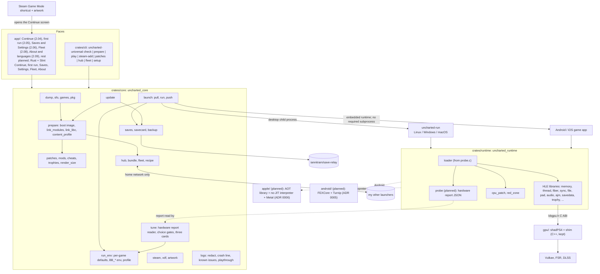
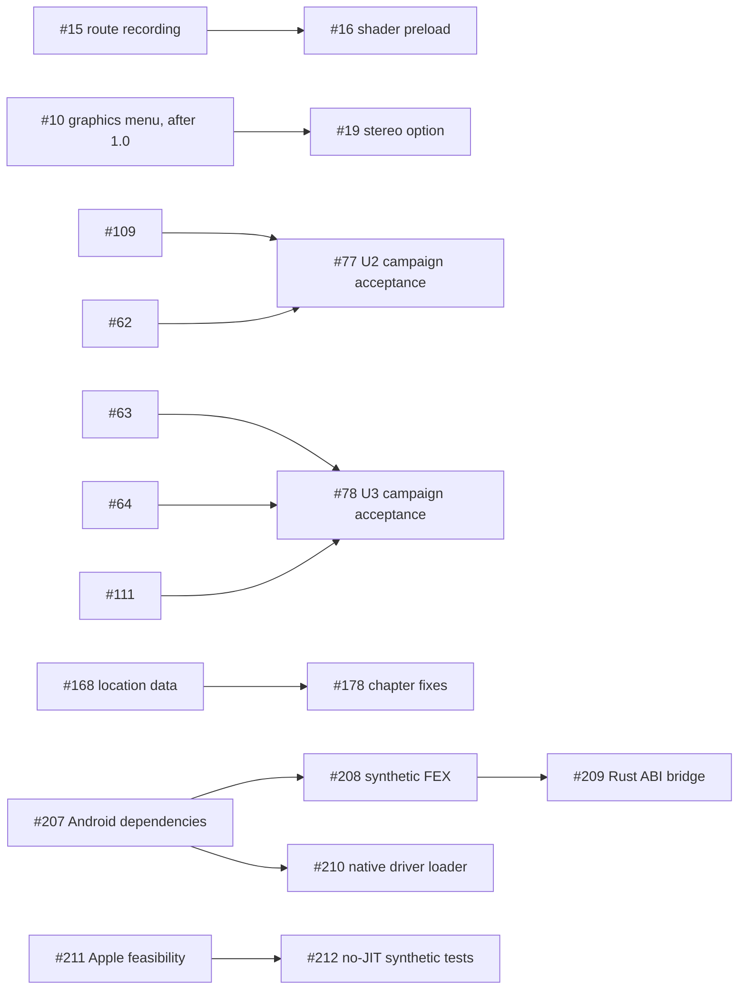

# Code map: Uncharted Universal

The intended shape of the repo for 1.0 (`SPEC.md`, approval "not yet": M15, M16 and M18 changed on 2026-11-18 and M11/M12/M15/M17/M18 updated on 2026-11-23 for split per-game mobile apps and resumable Dropbox game-file downloads via `save-relay#305`, waiting for the owner's re-approval; last approved 2026-11-17): **one Rust engine, two faces, one Rust runtime, three hubs; Windows and Linux/SteamOS for 1.0, plus the Mac and three split per-game iPhone/iPad apps (U1, U2, U3) with save-relay, resumable Dropbox game-file downloads and a controller (owner rulings 2026-11-17 and 2026-11-23, ROADMAP Decisions), and on every 1.0 device detected button prompts, full controller support and save-relay set up from the launcher (owner rulings 2026-11-18); Android (likewise split into three per-game thin APKs with resumable Dropbox game-file downloads) and the Apple play sessions and M21 check (8.08-8.10) in 1.x**. Our launcher, preparation tools, core and host runtime are Rust. The adopted graphics engine stays C++ behind `gpu/bbgpu.h`; its language boundary is intentional. Linux and Windows execute x86-64 game code natively. The planned Apple route is an ARM64 library generated by AOT recompilation of x86-64 guest code, with an interpreter fallback and Metal; feasibility remains gated by #211 and iOS has no JIT. Android runs x86-64 game code through FEXCore on ARM64. The engine (`crates/core`) and faces (`app/` and `crates/cli`) describe the approved design, not a claim that those workflows are implemented.

Status per module: **present** (implemented in the tree), **partial** (only named functions/metadata exist; remaining behavior is listed), **stub** (types/signatures exist but behavior is `NotBuilt` or unimplemented), **planned** (not in the tree), **legacy** (today's C or Python, removed when its Rust replacement is present and the game boots). Synthetic tests exercise stated test seams only; they do not prove device or game behavior. "Musts" columns cite `SPEC.md` (M1-M20; the spec has no Should items); every module that replaces C or Python also serves M20. An issue that implements a module moves its status in the same PR. Integration branch: `main` (our work; `upstream-main` is a copy of Supermedo's `main`).

Historical source baseline (retained snapshot; see the coordination checkpoint below): production `main` at [`ef27c862`](https://github.com/iannitram/Uncharted-Universal/tree/ef27c862dd15f60e64c51a1d285b96dec1be13b9); former upstream `8b66edc` is already its ancestor. `crates/runtime` is linked into the loader as a static library with runtime ABI version 8 (`trophy`, 3.05, and `memory`, 3.12, then piece 3.01: its `build.rs` builds the NID table and `gpu/`; 3.02 moved `time` and `rtc`, then 3.04 `content` and `display`, 3.07 `audio`, 3.09 `file`, 3.03 `sync`, 3.06 `savedata`, 3.08 `ajm`, 3.10 `pad`, 3.11 `kernel` and `services`, 3.14 `cpu_patch` and `red_zone`, and 3.15 `os`). In the current tree, `app/` has the Continue screen (piece 2.04: save cards, Continue and Play through the CLI, the conflict prompt and the controller path), the guided first run (2.05, #369: hub prepare, client pair and pull, Add to Steam; device check owed), the Saves and Settings pages (2.06), the after-crash screen (2.07), the Fleet page on fixture records (2.08) and About with the language button (2.09); save-relay is not built, `android/` has the pinned dependency recipe and synthetic smoke target (7.01a, #207), `tests/apple_nojit/` has the #212 synthetic interpreter harness, and `apple/` does not exist. The CLI (`crates/cli`) wires `check`, `prepare`, `play`, `steam-add`, `patches`, `hub`, `fleet`, `generate-art`, and `setup` to `crates/core`; `launch` has its flow with a local no-op relay until save-relay is linked (9.01). Rust test fixtures and source-level checks do not establish Android, Apple, or full-game execution. See the [platform readiness audit](audits/2026-11-06-universal-platforms.md) and [PEERS.md](../PEERS.md).

## Coordination checkpoint (2026-11-20)

The lane audit starts from `main` at `e39b50e9`; the older source-baseline paragraph
above and module history below are historical snapshots, not a fresh platform
acceptance audit. Current source has the Slint after-run path
(`app/src/main.rs`, `app/src/vm/after_crash.rs`) calling `logs::append` (covering `#185`'s implementation, pending acceptance audit to close), a wired CLI
command layer in `crates/cli/src/commands.rs`, and Android dependency sources (`android/`).

| Issue | Status on `main` | Lane |
|---|---|---|
| #426 | Merged and closed (PR #452, `dba42a2d` / `42132a7c`): `TextureCache::FindDepthTarget` stencil-association guard in `gpu/shadps4/video_core/texture_cache/texture_cache.cpp`; U1/U2/U3 device gameplay still owed | Flint (completed) |
| #403 | Merged and closed (PR #448, `591dabe8`): `IsKnownTileMode` in `gpu/shadps4/video_core/amdgpu/tiling.h` and both `TexturesBindableOnHelper` / `BindTextures` descriptor guards in `gpu/shadps4/video_core/renderer_vulkan/vk_rasterizer.cpp`; Windows CI and U1/U2/U3 checkpoint loads still owed | Terra (completed) |
| #427 | 4 of 5 units merged (PR #451, `896ac130` / `6f406a69`): `S_LSHR_B64`, `S_BFM_B64`, 64-bit shift amount, and `V_CVT_F32_UBYTE` with synthetic `shader-scalar-64-test` passing in CI run `44766909839`; `#5714` float atomic fallback split into `#450` (open) | Terra (4/5 merged; `#450` open) |
| #432-#436 / #297 | M21a-e render selection, HUD anchoring, camera, movie fit and resize; `#14`'s 16:10 requirements are carried by `#297` (`#432` in progress) | Existing resolution work first; no duplicate lane |

Source checks and synthetic tests do not close the device acceptance gates. The
coordinator records actual compiler/CI outcomes separately from agent reports.

## Merged foundations and what each still owes (2026-11-12)

These issues have their foundation on `main`; the issues stay open (or their module rows below stay partial) until the remaining work is done. None of them is device acceptance or platform completion.

| Issue | Merged in | Boundary on `main` and what remains |
|---|---|---|
| [#31](https://github.com/iannitram/Uncharted-Universal/issues/31) | PR #226 | Guards the `ExpandImage` copy with the fork's GPU-validity predicate and adds a synthetic regression target; handheld acceptance remains. |
| [#35](https://github.com/iannitram/Uncharted-Universal/issues/35) | PR #225 | Consumes equeue request signals under the mutex before `io_context.run()` and adds a 10,000-signal regression target; handheld Load Game acceptance remains. |
| [#37](https://github.com/iannitram/Uncharted-Universal/issues/37) | PR #224 (closed) | Corrects zero-operand decode and lowers both opcodes to device barriers with a synthetic regression target. |
| [#175](https://github.com/iannitram/Uncharted-Universal/issues/175) | PR #227 | 19 known-issue entries linked to player-posted crash logs, loaded by a test that reads the shipped file. |
| [#188](https://github.com/iannitram/Uncharted-Universal/issues/188) | PR #228 (closed) | Missing, malformed or unknown SFO title identity refuses with `BadDump`; title-to-region mapping and full prepare/start acceptance remain outstanding. |
| [#189](https://github.com/iannitram/Uncharted-Universal/issues/189) | PR #231, #541 | Pairing, discovery, encrypted resumable bundle and game-data transfer (`HubService`, CLI `hub serve`/`pair`/`pull`/`pull-game`, launcher `pair_and_pull_service`) and install rollback. Windows peer storage and device acceptance remain. |
| [#190](https://github.com/iannitram/Uncharted-Universal/issues/190) | PR #223 | Writes the five original artwork outputs from Rust; `launcher/uncharted_art.py` and its tests deleted in 2.11 (#377). |
| [#206](https://github.com/iannitram/Uncharted-Universal/issues/206) | PR #232 | Bounded shared SELF/plain-ELF parsing and synthetic fixtures; this is not the prepare/link pipeline. |
| [#207](https://github.com/iannitram/Uncharted-Universal/issues/207) | PR #229, PR #255, PR #516, PR #529, this PR | Pinned Android dependency recipe, synthetic native target and the vendored Turnip KGSL/FEX patch series. Clean-host NDK r30 (`30.0.16248370`) + SDK 35 (`build-tools;35.0.1`) fetch, patch, build, and `arm64-v8a` bionic link verified (`libvulkan_freedreno.so`, `libSDL3.so`, `uncharted-android-smoke`, `uncharted-android-fexcore-smoke`, `uncharted-android-fex-smoke`, `test_android_fex_smoke`), and all four synthetic smoke binaries executed on an attached Pixel Fold (`arm64-v8a`, Android 17 / API 37) via `adb`; Turnip KGSL Vulkan runtime execution and a full game APK remain separate. |
| [#211](https://github.com/iannitram/Uncharted-Universal/issues/211) | PR #230 | Feasibility matrix and owner-run checklist only. CPU/Metal probes were not run; this remains a partial, plan-only gate. |

Apple peer research is on local branch `research/apple-native-peers` / `6c246ba`; it adds bounded Mac-port references to `PEERS.md` and establishes no iOS no-JIT or Uncharted engine compatibility claim.

## Game dump & SELF container format

On x86-64 hosts (Linux/SteamOS and Windows), "native" means the game's original x86-64 machine code runs directly on the host CPU with PS4 OS services reimplemented in `crates/runtime` (and remaining C shims in `src/`) and rendering handled by the vendored shadPS4 Vulkan video core in `gpu/`.

Offline prep (`crates/core::prepare::load_image` and `crates/core::link`, which replaced legacy `scripts/prepare.py` and `scripts/link_modules.py`) merges the game executable (`eboot.bin`, `big2-ps4_Shipping.elf`, or `big3-ps4_Shipping.elf`) with `sce_module/libc.prx` and `sce_module/libSceFios2.prx` into `out/<game>/boot-linked.bin`.

- **PS4 SELF containers are expected:** Extracted shadPS4 / fPKG dumps keep the PS4 SELF container header (magic `0x1D3D154F`), so Linux `file` reports them as `data`. **Do not mistake `data` or SELF magic for an encrypted dump.** `prepare::load_image` parses SELF headers directly and only rejects segments whose SELF segment flags set `encrypted` (`0x2`) or `compressed` (`0x8`).
- **Locating the dump locally:** Point `BB_GAME_DIR` (or `BB_GAME_DIR_U1`..`U3`) at the extracted dump, or use the gitignored local symlink `game/` in the repo root (on the Strix Halo SteamOS machine, pointing to `/home/deck/Games/The Nathan Drake Collection`; see `ROADMAP.md` `## Game files`). Never commit game files or machine-specific symlinks (M9).

## Platforms (R04)

| Device family | 1.0 device | Game code | Renderer | Built on (hub) | Launcher | Save sync in | CI |
|---|---|---|---|---|---|---|---|
| Linux / SteamOS | the AMD handheld, the Strix Halo tablet | native x86-64 | shadPS4, Vulkan (RADV) | the Strix Halo tablet; the AMD handheld pulls | Slint app (AppImage), opened by the Steam shortcut | the launcher | `ubuntu-latest`: Rust workspace; Linux package in build.yml with the boot smoke test (3.01) |
| Windows | the RTX 3090 Ti desktop | native x86-64 | shadPS4, Vulkan | the desktop | Slint app | the launcher | `windows-latest`: Rust workspace; full GPU/runtime build pending (6.01) |
| macOS | a Mac with Apple silicon | planned ARM64 library generated from x86-64 guest code; interpreter fallback | Metal | the Mac | Slint app (also builds and installs the iOS app) | the launcher | `macos-latest` (arm64, checked by the workflow's `uname -m` step): Rust workspace build and tests, then `cargo build -p uncharted_runtime --lib --target aarch64-apple-darwin` (8.02, #407); no `gpu/` build; the Mac app is 1.0 since the owner's rulings of 2026-11-17 and 8.05 releases it; application build pending (8.05) |
| iOS / iPadOS | iPhone or iPad + controller | planned ARM64 library generated from x86-64 guest code; no-JIT interpreter fallback | Metal | the Mac builds three separate per-game thin unsigned `.ipa`s (U1, U2, U3) into Dropbox, installed with SideStore; each app prompts on boot ("Would you like to download the rest of the game files?") and pulls its files resumably using `iannitram/save-relay` directly (`save-relay#305`, 8.13 #523; built and bug-tested with `save-relay`, never from scratch) | none: three per-game thin apps (U1, U2, U3) | each per-game app (links `iannitram/save-relay` C/Swift interface for both save cloud sync and resumable Dropbox game-file installs; built and bug-tested with `save-relay`) | `macos-latest` (arm64, checked by the workflow's `uname -m` step): `cargo build --target aarch64-apple-ios -p uncharted_runtime --lib` (8.02, #407); no `gpu/` build; signed application build pending (8.05) |
| Android | Snapdragon (Adreno/Turnip) or Google Tensor (Mali, e.g., Pixel Fold 1) + controller | FEXCore (x86-64 to ARM64) | shadPS4, Vulkan (Turnip via `libadrenotools` on Snapdragon; validated system Mali Vulkan on Tensor, #536) | the Strix Halo tablet prepares per-game builds; three separate per-game thin APKs (U1, U2, U3; 7.03 #524) boot and prompt ("Would you like to download the rest of the game files?"), pulling files resumably using `iannitram/save-relay` directly (`save-relay#305`, 7.04 #525; built and bug-tested with `save-relay`, never from scratch); Pixel Fold 1 inside/outside screen detection & full M21 visual adaptation (7.07 #537) | three per-game thin APKs (U1, U2, U3) | each per-game APK (links `iannitram/save-relay` C/JNI interface for both save cloud sync and resumable Dropbox game-file installs; built and bug-tested with `save-relay`) | `ubuntu-latest`: runtime static-library cross-build; NDK/GPU/APK link pending (7.02) |

Rules that keep it portable: `crates/core` is pure Rust (no C library, no OpenSSL; the hub's crates are `mdns-sd`, RustCrypto `spake2`, `chacha20poly1305`, `sha2`, behind feature `hub`); no `std::os::*` outside `platform`, `steam` and the runtime's `os` module; every OS rule takes its folders from `platform::Vars`, so Linux, Windows and Mac rules are tested on every runner; tests build temporary folders under `std::env::temp_dir()`. The runtime is the only crate with `unsafe` and FFI (`crates/core` has `#![forbid(unsafe_code)]`), and each `unsafe` block carries a `// SAFETY:` line. Anything that must call a C library (the Vulkan hardware probe, SDL) lives in the runtime and reaches `crates/core` as data (a JSON report) or through a trait, never as a call.

## How it fits together


```mermaid
flowchart TD
    subgraph Faces
      App["app/: Continue (2.04), first run (2.05), Saves and Settings (2.06), Fleet (2.08), About and languages (2.09), rest planned; Rust + Slint<br/>Continue, first run, Saves, Settings, Fleet, About"]
      CLI["crates/cli: uncharted-universal check | prepare | play | steam-add | patches | hub | fleet | setup"]
    end
    Steam["Steam Game Mode shortcut + artwork"] -->|"opens the Continue screen"| App
    App --> Core
    CLI --> Core
    subgraph Core["crates/core: uncharted_core"]
      Dump["dump, sfo, games, pkg"] --> Prepare["prepare: boot image, link_modules, link_libc, content_profile"]
      Prepare --> Patches["patches, mods, cheats, trophies, render_size"]
      Launch["launch: pull, run, push"] --> Saves["saves, savecard, backup"]
      Launch --> RunEnv["run_env: per-game defaults, BB_* env, profile"]
      Prepare --> Hub["hub, bundle, fleet, recipe"]
      SteamMod["steam, vdf, artwork"]
      Logs["logs: redact, crash line, known issues, playthrough"]
      Tune["tune: hardware report reader, choice gates, three cards"] --> RunEnv
      Update["update"] --> Prepare
      Update --> Saves
    end
    Launch -->|"desktop child process"| DesktopRunner["uncharted-run<br/>Linux / Windows / macOS"]
    Launch -->|"embedded runtime; no required subprocess"| MobileRuntime["Android / iOS game app"]
    subgraph Runtime["crates/runtime: uncharted_runtime"]
      Loader["loader (from probe.c)"] --> HLE["HLE libraries: memory, thread, fiber, sync, file, pad, audio, ajm, savedata, trophy, ..."]
      Loader --> Patch["cpu_patch, red_zone"]
      Loader --> Probe["probe (planned): hardware report JSON"]
    end
    DesktopRunner --> Runtime
    MobileRuntime --> Runtime
    Probe -.->|"report read by"| Tune
    HLE -->|"bbgpu.h C ABI"| GPU["gpu/: shadPS4 + shim (C++, kept)"]
    GPU --> VK["Vulkan, FSR, DLSS"]
    Runtime -.Apple AOT + interpreter.-> Metal["apple/ (planned): AOT library + no-JIT interpreter + Metal (ADR 0006)"]
    Runtime -.Android.-> FEX["android/ (planned): FEXCore + Turnip (ADR 0005)"]
    Saves --> SR[("iannitram/save-relay")]
    Hub <-->|"home network only"| Peers[("my other launchers")]
```

## Modules: `crates/core` (`uncharted_core`)

| Module | Status | Owns | Replaces | Musts |
|---|---|---|---|---|
| `error` | present | `Error` with stable `code()` and plain message per variant, `NotBuilt`, `Result` | | all |
| `platform` | present (#213) | `Os` (linux, windows, mac, ios, android), `Vars` (home, data, config from env lookup; Linux/Windows/macOS contracts tested independently of host), `AppDirs` (`<config>/uncharted-universal`, `<data>/uncharted-universal`: installs, backups, logs) | the folder code of legacy `uncharted_linux.py` (`config_dir`, XDG folders) and legacy `bbport_launcher_win.py` | M7, M11, M14, M20 |
| `host_env` | present (2.10) | the host's library injection out of the environment on Linux: `HOST_ONLY` (`LD_PRELOAD`, `LD_LIBRARY_PATH`, `LD_AUDIT`, the GTK, GIO, GDK and Python paths) removed with a non-empty value kept as `BB_HOST_<name>`, Steam's overlay and fossilize Vulkan layers turned off; `changes` (pure, tested per OS), `apply_to_command` (a child), `clean_process` (first thing in `main` of `uncharted-app` and `uncharted-universal`); the AppImage's `packaging/linux/AppRun` makes the same changes for every path, the classic launcher's `--play` included (`tests/test_apprun.py` keeps its lists equal to these) | `packaging/bbport-entry.c` (deleted) | M7, M20 |
| `language` | present (2.09) | the seven interface languages (`Language`: en, es, pt, fr, de, it, ja, with native names), the `ui_language` setting in `<config>/uncharted-universal/settings.json` ("" is Automatic; `read_setting`, `write_setting` keeps other keys and writes atomically), `next_setting`, and `resolve` from the setting and the system locale | the language choice of legacy `uncharted_i18n.py` | M10, M20 |
| `sfo` | present | `param.sfo` reader, read-only and bounds-checked: `parse` to a key map of `SfoValue` (`Int` for format 0x404, else `Text`; any key, among them `TITLE_ID`, `APP_VER`, `VERSION`, `TITLE`), `text`, `app_version` (`APP_VER`, else `VERSION`); a bad signature, an offset or length past the end, an unterminated key or a non-4-byte integer is a plain `BadDump`, never a panic; never writes; covered by synthetic byte-fixture tests | legacy `prepare.py` `sfo()` | M11, M20 |
| `games` | present (identity; revision gate fails closed) | `Game` (U1, U2, U3) with its key, name and executable (`eboot.bin`, `big2-ps4_Shipping.elf`, `big3-ps4_Shipping.elf`); the four collection title ids (`CUSA02320`, `CUSA02343`, `CUSA02344`, `CUSA02826`), one family shared by all three games, so a game is told by its executable; `title_region` rejects unknown IDs but leaves known IDs unmapped until verified `param.sfo` evidence; `SUPPORTED` stays empty until device runs; `check_revision` returns a plain `WrongRevision` refusal for every revision until then (issue #217) | `NDC_IDS`, `NDC_ELFS` in legacy `patches.py`; `EXECUTABLES` in the legacy Python runner | M11, M20 |
| `pkg` | present | `.pkg` container analysis and bounded safe extraction; encrypted entries skipped, delta packages refused | legacy `pkg.py` | M11, M20 |
| `dump` | present | `DumpReport`, `check` (folder layout and decrypted executables); missing, unreadable or unknown `param.sfo` title identity fails closed with `BadDump` before a report is returned (#188) | new (#172; its Python brief is dropped, it is written in Rust) | M9, M11 |
| `content_profile` | present: offline metadata conversion and serialization, covered by synthetic tests; not wired to runtime | `from_sfo`, `to_bin` (the exact 28-byte `BBCONT01` record), `to_json` (pretty metadata with trailing newline); `Sku` is a probe setting, not a licence check | legacy `content_profile.py` | M7, M20 |
| `link` | present: `link_modules` (#283) and `link_libc` (#284), covered by synthetic tests; driven by `prepare` (1.10) | `link_modules` and `link_libc`: module and libc import tables for the boot image. One module reader (`Module::read`: SCE dynamic tags, strings, symbols, relocations, library and module identities) and the `fs:` to `gs:` rewrite serve both. `link_modules` reads a `BBPROBE2` `boot.bin` (anything else is `Prepare("linker expects freshly prepared BBPROBE2")`), places `libc.prx` and `libSceFios2.prx` 64 KiB aligned after it, binds imports by (NID, library, module) with the `libSceLibcInternal` fallback to libc, and writes `boot-linked.bin` (`BBPROBE5`) and `link.json`; a missing module is a plain `Prepare` error, unresolved imports are left to the host runtime and listed in the report. `link_libc` links `eboot.bin` against `sce_module/libc.prx` into a separate `boot-libc.bin` (`BBPROBE4`) and `libc-link.json`, leaving `boot.bin` untouched. Byte-for-byte parity with the Python on synthetic fixtures only | legacy `link_modules.py`, legacy `link_libc.py` | M7, M20 |
| `prepare` | present: `load_image`, `nid`, `prepare` and `locate` (#289) | `load_image` maps a SELF (magic `4f 15 3d 1d`) or plain ELF into the memory image, entry point, normalized ELF bytes and validated program headers, refusing unsupported or truncated required segments, invalid file/memory ranges and unmapped entries. `prepare` reads `param.sfo`, runs the revision gate (`games::check_revision`) before any write (a refused revision leaves the install folder untouched), then checks the executable, `libc.prx` (`_init_env` proved `RET` by NID, never assumed), the content profile and the patches before the first write; it writes `boot.bin` (`BBPROBE2`) and `analysis.json`, runs `link::link_modules` (and `link::link_libc` when the executable is `eboot.bin`), writes `content.bin`, `content-profile.json`, `patches.bin` (when a patch folder is given) and `boot-res-<W>x<H>.bin`/`.json` (when a render size other than 1080p is asked), and writes `install.json` last. The install never holds a dump file (M9): no `eboot.elf` or `entry.bin` as `prepare.py` wrote, every name checked against `bundle::is_forbidden`. `locate` reads `BB_GAME_DIR_U1`..`U3`, then `BB_GAME_DIR`, through a fake-able env closure, with the `eboot.bin` rule for a game dumped on its own; neither set is `Env`. Patch segments follow legacy `patches.py` (`vaddr` of each `PT_LOAD`), not `patches::eboot_segments`. `games::SUPPORTED` is still empty, so the public `prepare` refuses every revision until device runs fill it | Synthetic Rust tests: the `tests/test_prepare.py` cases ported, a whole install from a hand-built dump (boot image byte layout, analysis, content profile, patches, linked images), a listing of the install folder against the dump (M9), refusals that write nothing, `locate` with a fake env. Parser contract ported from `Supermedo/uncharted_pc` legacy `prepare.py` at `8b66edc0192ea246ca63b360857402a0aa55626d`; orchestration from the legacy Python runner (`prepare`, `locate`). the Python `prepare.py` was deleted in 2.11 (#377) | M7, M9, M11, M20 |
| `patches` | present | third-party literal patches per executable (`APP_VER` and title decide): `roxmltree` parse (8 MiB, 100,000-node, 64-depth bounds; DTD expansion and external resolution disabled), `applicable`, `select`, bounds-checked `compile` to the patch image, `about_list` for About; unsupported patch lines are retained as unavailable and discarded whole | external-patch half of legacy `patches.py` | M7, M8, M20 |
| `mods` | present (#314): covered by synthetic tests; not wired to the launcher or runtime | Uncharted's mod folder layouts (a content root holds `u1data`, `u2data`, `u3data` or `shareddata`; `app0/` or a collection title-id wrapper; one archive wrapper folder; case-insensitive), `discover`, `ModConfig` (`mods.json` `parse`/`load`), `selected` (disabled, order, new folders last), `layers` (shadPS4's `<game>-mods`, a direct mods folder, the master toggle), `mod_files` (symlinks, junctions, non-regular files and executable/system replacements refused), `build_overlay` (later mods win, the dump's spelling, file/folder conflicts refused, the JSON list written to `out` for the runtime's file VFS, 3.09) | legacy `mods.py` | M7, M20 |
| `cheats` | present: covered by synthetic tests; not wired to prepare or the launcher yet | the built-in `TABLE` (health and ammo for the 01.00 and 01.02 executables of all three games) and its `parse`; `compile` hashes the executable (SHA-256), reads each cheat's original bytes through the load segments of `prepare::load_image` and reports an unknown build or unexpected bytes in `skipped`, never as an error; `apply` refuses a write outside the image and writes nothing; `to_cheats_bin` (the `BBPATCH2` layout, base 0); `setting` and `for_game` for `BB_CHEATS` | legacy `cheats.py`, `game_cheats` in the legacy Python runner | M7, M20 |
| `trophies` | present (#307): covered by synthetic tests; not wired to a CLI or launch path yet | AES-128 (FIPS-197, CBC decrypt); `TrophyKey`, the console's trophy key, supplied at run time (`BB_TROPHY_KEY` or a key file, never in the repo, a log or an error: M9) and `title_key`; `read_trp`/`parse_trp` (bounds-checked), `decrypt_esfm`, `key_fits`, `find_npcommid` (`npbind.dat`, then the `trp_file` table, then every `NPWRnnnnn_00`); `parse_xml` (`roxmltree`, DTD off) and `load_trp`/`load` with `TROP_<lang>` text over `TROP`; the `trophies.txt` cache (`FORMAT` 2, the one `src/runtime_trophy.c` reads) with `escape`/`unescape`, `write_cache`, `read_cache`, `prepare` keyed by the pack's stamp and language; `read_unlocks` (earliest time per trophy, garbage lines skipped) and `progress` per grade. Showing trophies in the launcher is after 1.0 (#12). the Python trophies code was deleted in 2.11 (#377) | legacy `trophies.py` | M7, M9, M20 |
| `render_size` | present (#277), sizing used by the Windows native loader (#432) | `automatic_size` chooses an aligned size with `aspect` within the available render heap growth. `game_res_env` derives `BB_GAME_RES` and heap variables. `patch_image` and `deck_720p_patches` return `CheckedWrite` data. `apply_checked` verifies each write against the image. Tested on synthetic fixtures | legacy `render_res.py`, legacy `render_720p.py` | M5, M13, M20, M21 |
| `aspect` | present (#305), automatic sizing used at Windows startup (#432) | Pure aspect math for resolution independence. `render_size` calculates the width at a chosen height. `safe_area` gives the centred 16:9 HUD rectangle. `fov` gives the mode and horizontal and vertical factors. `fit_rect` calculates the letterbox or pillarbox with offsets. A zero size is a `RenderSize` error | new (M21, called by 3.18) | M21 |
| `run_env` | present: covered by synthetic tests; not wired to the runtime | per-game defaults (`fix_defaults`: U1/U2/U3 readback, copy64 and `BB_TOGGLE2` values) and `build_env`: the `BB_*` environment from the device profile, settings and the player's own variables (player wins), the fixed renderer shader hashes, `BB_VBLANK_HZ` 60, U3 `BB_COPY64_EOP_READBACK`, U1 `BB_SKIP_COLLECTION_MENU`, `BB_GAME_RES` heaps via `render_size`; path-dependent variables (`BB_CONFIG`, `BB_USER_DIR`, saves) and the upscale preset sizes are not built here | the legacy Python runner | M5, M7, M20 |
| `launch_settings` | present (#453, PR #455): shared display parser, typed run conversion and profile policy, fresh persisted loader; app parser/profile rules delegate here. Production CLI loader wiring is #454; GUI launch remains #444 | `crates/core/src/launch_settings.rs`; app `settings_store` and `vm/settings` | Core unit tests pass; app/Windows integration and device acceptance remain owed | 1.15 / 2.06 | M5, M10 |
| `profile` | present | `DeviceProfile` (amd-handheld 20 W 30/60 Hz, strix-halo-tablet, desktop, mac, ios, android), `builtin`, `by_id`, `detect` (OS and CPU model name: Z1 Extreme and the Deck's custom APUs are the handheld, AI Max+ 395 the Strix Halo tablet) and `detect_with_os_release` (`ID=steamos` on Linux marks the handheld); the handheld's env is Deck mode's (`deck_environment`: 30 Hz, 1280x800, 720p render, Fifo, fullscreen, frame stats, Deck prompts, no upscaler or frame generation). Other profiles' values are starting points for the stage-5 device runs | Deck mode in legacy `uncharted_linux.py` | M5, M13, M20 |
| `saves` | present | `save_root`/`user_dir` (per OS through `platform::Vars`; an existing `<install>/user` keeps its saves), `split_saves`, `is_synced` (only `SAVEDATA0N*` entries; never `where.json`, `save_slots.json`, `*.tmp`), the save slots (`select`, `copy`, `delete`, `mapping` ..), `relay_manifest(game)` (one save-relay format-1 manifest per game, `saves_from` launcher) and `relay_saves_dir` (the `--saves-dir`: the selected slot's folder, so the manifest follows the slot) | the save folders of the legacy Python runner (`SAVE_FOLDERS`, `split_saves`), legacy `save_slots.py` | M4, M18, M20 |
| `savecard` | present (#285) | `SaveCard` (game, slot, picture from the save's `sce_sys/icon0.png`, title (`TITLE`, else `MAINTITLE`) and detail (`DETAIL`) from its `param.sfo` through `sfo`, newest file time, device, build id); `read_card` (missing or damaged files give `None` fields, an unreadable folder is `Saves("no save at <path>")`), `latest` (newest `saved_unix` among the game's `SAVEDATA0N*` folders, the lower name on a tie, `None` for no save), `side_by_side` (`server_is_newer` when the server's time is strictly larger); device and build id are left for the launcher to fill. Synthetic fixtures only | | M10 |
| `backup` | present (#286) | `backup_saves`, `list`, `prune` (keep 10) | | M19 |
| `update` | present (#290) | back up, re-prepare, recount saves (fewer synced files after the rebuild is an error naming the backup; keep 10) | legacy `uncharted_launcher.py` update check (`check_update`, `install_update`) | M19, M20 |
| `launch` | partial: flow, LoadExec loop, session environment and desktop child runner present, covered by fake `Relay`/`Runner` tests (#312); the concrete `Relay` (`relay.rs`) waits on save-relay (#163), `uncharted-universal play` (2.02) runs it with its own `RuntimeRunner` (`--guest-argv` after a switch), not wired directly into `app/` (which invokes `uncharted-universal play`), and the per-start preparation of the legacy Python runner (boot image, render-size patch, content profile, trophies, patch files, cheats) is not yet wired into `launch::play` | `Relay` and `Runner` traits; `play` (pull, a conflict asks once and pulls again with the answer, Offline plays on, a relay error stops before the game; then the game; then push, a conflict asks again, a push error comes after the game has quit); `run_until_quit` (the `LOADEXEC_EXIT` 101 loop: `BB_LOADEXEC_FILE` removed before each start, the named executable started with its `--guest-argv` list and its own per-game defaults, `BB_SKIP_COLLECTION_MENU` 1 to 0 after a switch, `BB_U1_DIRECT`); `Session::env` (`run_env::build_env` plus `BB_CONFIG`, `BB_INPUT_CONFIG`, `BB_GPU_USER_DIR`, `BB_USER_DIR`, `BB_SAVEDATA_DIRS` off Windows, `BB_EXE`; the player wins); `ChildRunner` starts `uncharted-run` with the legacy runner's command line and stdin closed. Mobile apps embed the runtime and iOS does not require a subprocess | `main` of the legacy Python runner | M7, M10, M18, M20 |
| `logs` | present (1.26, #309): `redact`, `crash_line`, known-issues matcher, playthrough, `rotate`, `health`, `create_report` (a folder of redacted text files); for the after-crash screen (2.07, #343): `last_crash`, `load_where` (`where.json`), `issue_text` (Copy log for GitHub, with the game and chapter) and `bug_form_url`; the app calls them, the CLI does not yet | `redact` (no game paths or hex keys in logs), `crash_line` (reads the `Crash:` line the runtime prints, #168), the known-issues matcher over `crates/core/data/known_issues.json` (#169, seeded by #175), `playthrough.jsonl` (#170), log rotation, health and the report bundle | legacy `uncharted_logs.py` and `crash_signature()` in legacy `uncharted_linux.py`; the matcher and the playthrough log are new | M1-M3, M9, M20 |

Known-issue seed note (#175): the matcher now has 19 entries backed by player-posted crash logs, each linked to its upstream issue and scoped to the reported game/location. Signatures preserve reported assertion text or guest fault offsets; no addresses or workarounds are inferred.
| `recipe` | present (#310 `recipe_for`; 1.27 the per-chapter fix list of #178) | `Target` (linux, windows, mac, ios, android), `Hub` (strix-halo, desktop, mac) with `key`/`from_key` (unknown key: `Error::Hub`), `hub_for`, `serves`; `Recipe` and `recipe_for`: the hub, the prepare steps per target in the legacy Python runner order (check dump, check revision, boot image, link modules, link libc, render size, content profile, trophies, patches, bundle) and `recompiled_library`; Mac and iOS put render size and patches before the recompile (ADR 0006), and iOS ends with the iOS app build, an unsigned .ipa put in Dropbox for SideStore, instead of a bundle. Data only: the steps are not wired to `prepare`. The per-chapter fix list of #178: `CHAPTER_FIXES` (U2's brightness flicker fix on in Nepal, its aim-focus and exact-GPU-results fixes off in the Borneo jungle, #157; chapter names a seed until a real save confirms them), `chapter_of` (the chapter in `where.json`: subtitle, else title), `fixes_at` (which fixes are on and off there; none for an unknown place) and `chapter_env` (the `BB_*` values over `run_env::fix_defaults`, the player's own variables win). The runtime reading `where.json` on each save and the live toggles are 3.06 | the chapter list is new to the per-game defaults of the legacy Python runner `fix_defaults` | M5, M11, M15 |
| `bundle` | present | `Bundle`, text manifest, sorted file hashing (files under `shaders/` are shader translations), verification and install; rejects game/dump content (including `.psarc` archives), driver pipeline caches (`.vkc`, `vulkan_driver*`, `pipeline_cache*`), device-owned data and unsafe relative paths; game-derived data uses a separate hub protocol and never enters this manifest | | M9, M11, M12 |
| `hub` | partial (feature `hub`) | mDNS discovery and announce (4.01, `hub/discovery.rs`, `mdns-sd`): `discover(wait_ms)` browses `_uncharted._tcp`, parses the TXT schema in ADR 0004, drops malformed records and non-home addresses, de-duplicates; `announce` refuses non-home addresses; the `Mdns` seam has an in-process `MemoryMdns` so CI finds and pairs with a fake hub on loopback (real multicast on loopback in Linux CI only). Pairing (4.02): random six-digit code, a `PairingServer` accept loop with one limiter per remote address (3 wrong codes, 5-minute lockout) and a per-code cap, the client `pair_with_hub`, SPAKE2 with name-bound two-way confirmation and acknowledgement, every failed exchange counted; peers stored with `remember_peer`/`remove_peer` in the Unix mode-0600 peer file; sealed XChaCha game-data transfer (`serve_game`/`pull_game`, skipping device-owned `saves`/`logs`/`mods`/`user`) with authenticated direction/sequence, bounded manifests/chunks, hashes, ASCII-only paths (rejecting Unicode normalization ambiguity), case-fold-safe atomic staging, an incomplete marker, cross-process same-stage pull lock, and cleanup of generated temps only inside an ownership-marked reserved work directory; sequential resume; checked TCP home-network transport. Bundles (4.03): `serve` sends the newest `builds/<build name>/bundle.txt` for the target and its listed files (shader translations included, never a driver pipeline cache) over the same sealed per-file exchange, after the request proves the paired key and before any build is read; `pull` stages with resume, keeps the incomplete marker until `bundle::verify` passes; covered by the loopback fake-hub test `crates/core/tests/hub_bundle.rs`. Service (4.05, `hub/service.rs`): `HubService` takes pairing, bundle pulls and prepared game-data pulls (`with_game_data`) on one TCP listener (default port 47210, one opening packet names the request; a device that never paired, or a target the hub does not serve, is told why), with the clients `pair_with_service`, `pull_from_service`, `pull_game_from_service` and launcher `setup::client::pair_and_pull_service`; covered by `crates/core/tests/hub_service.rs` and the CLI fake hub `crates/cli/tests/hub_loopback.rs`. Windows ACL/atomic peer-file replacement remains unimplemented, so paired-device storage fails closed there | | M11, M12 |
| `fleet` | present | `DeviceRecord`; `drift` (same build id: none; else a different patch level; else a different build) and the Continue screen `warning`, which names the device that made the save and offers "update this device first, or play on and keep both saves"; `to_line`/`from_line` plus `read_records`/`write_records`/`upsert`/`upsert_file` for atomic `fleet.txt` persistence; covered by unit tests | | M12 |
| `vdf` | present (#287) | Steam binary KeyValues `read`, `write` (types 0x00 map, 0x01 string, 0x02 u32; cut-short, unknown type, non-UTF-8, trailing bytes and nesting past 64 are `Error::Steam`); tested against a `bbport_steam.dump`-written fixture | legacy `bbport_steam.py` | M13, M20 |
| `steam` | present (#287): wired through `setup` (2.05): the first run's Add to Steam and `uncharted-universal setup steam` | `crc32`, `shortcut_app_id`, `Shortcut`, `shortcut_entry`, `upsert` (by appid, keeps `LastPlayTime` and `tags`), `userdata_roots`, `write_shortcut` (Steam closed, `.bak` kept, nothing written if any user's file is damaged), `write_artwork`; the shortcut opens the launcher's Continue screen (M13) | legacy `bbport_steam.py`, the file writing of legacy `uncharted_art.py` | M13, M20 |
| `artwork` | present (#308) | Steam grid paths and dimensions; `source_file` (box art `sce_sys/icon0.png` for grid, wide grid, logo and icon; `sce_sys/pic1.png` for the hero) and `render` (framed, covered or fitted to each size, PNG out, `None` without the picture); `Crop` and `render_custom` for a player-chosen picture (the artwork editor's zoom and focal point). Not yet called by `steam::write_artwork` (1.21) or the launcher. The Windows collection-art command writes the preserved reference images bundled in `crates/core/data/collection-artwork` (#190) | legacy `uncharted_art.py` (`steam_artwork`, `cover`; the SteamGridDB download `steamgriddb_artwork` is dropped) | M13, M20 |
| `setup` | present (2.05, #369): covered by tests on temp folders and a loopback fake hub; the device check is owed | the first run's shared steps for the app and the CLI: `is_first_run` (no install, no paired hub), the dump folder (`BB_GAME_DIR*`, else the noted folder) and `dump_candidates` (two levels under the variables, the noted folder, Games, Downloads, Desktop and home), `prepare_plan` and `prepare_all` (one game failing does not stop the others), `pairing_code`, feature `hub`: `client::hub_address` (address and port, home network only), `client::pair_and_pull` (pair, save the peer, pull and install over one connection; `install_pulled` keeps the device-owned folders), `add_to_steam` (shortcut once for every user, icon at the first user's grid copy, then artwork; refuses while Steam runs), `steam_command` (quit and start Steam), `steam_running` | legacy `uncharted_launcher.py` first run, legacy `bbport_steam.py` (`steam_running`) | M7, M11-M13 |
| `relay` | partial (9.01, #445) | Windows Play invokes the bundled [save-relay](https://github.com/iannitram/save-relay) `v1.0.0-rc.2` CLI (`crates/core/src/relay.rs`) for each title and selected slot before the runtime starts and after it exits; Continue-screen conflict UI, AppImage bundling, and cross-device release round trips remain open | #163, ROADMAP 9 | M18 |
| `tune` | present | parses the hardware report JSON (#171: GPU name/vendor/generation, dedicated/shared memory, selected integrated GPU and hybrid topology, refresh rate, CPU cores/instruction support); gates frame generation and sizes above 1080p below 6 GiB, DLSS on RTX, and warns on integrated selection in a hybrid machine; `upscalers` adds the DLSS and FSR rules on those gates (#147: DLSS on any RTX, DLSS Frame Generation on RTX 40 at 2x and RTX 50 up to 4x, FSR 4 on RDNA 3/4 and RTX 40/50, the default upscaler `dlss`, else `fsr3` only on the shim's measured FSR 3.1 device names, else `off`; the game's own probe keeps the final word); the three cards Handheld 30, Balanced 60, Max quality (#174: `pick` from the device; `pick_for`, the Settings page's entry point, keeps them to `upscalers`: the default upscaler, and a hidden frame generation such as DLSS's on an RTX 30 becomes FSR 3's at 120 Hz or more, else off). live collection is `uncharted-run --probe` in `crates/runtime`; `parse_bench` reads the `BB_BENCHMARK` report of #173, `bench_from` takes one per card (a crashed run is not benchmarked) and `cards_from` runs probe, bench and `pick_for` for the Settings page (2.06) | the report consumes the future runtime replacement of legacy `bbport_vulkan.py`; the picker is new | M5, M13, M20 |

`vdf`, `steam`, `platform`, `bundle`, `hub`, `fleet`, `backup`, `update`, `launch` and the shape of `savecard` are copied from iannitram/totk-native (MIT) with credit in the file header. All of them are now implemented in `crates/core` (the only remaining `Error::NotBuilt` in `crates/core` is `games::title_region`), while `relay` (#163) and Windows peer-file ACL storage (`hub`) remain pending.

### Legacy behavior and Rust parity

Some requested features already exist in the legacy C/C++ and Python product. That does not mean the new Rust launcher/runtime has parity or that game/device acceptance is complete:

- Xbox, Nintendo, and PlayStation controller glyphs are selected by the [Rust pad path](../crates/runtime/src/pad/host.rs) (`prompts_device`, via `SDL_GetGamepadType` and button label) and drawn in `gpu/shadps4/video_core/texture_cache/button_prompts.{h,cpp}` (`BB_BUTTON_PROMPTS=nintendo|xbox|playstation|keyboard|auto`); #11 folded into 3.23 (#439) and 8.12 (#441), 1.0 by the owner rulings of 2026-11-18, with physical controller acceptance on handheld/tablet/desktop (`needs-owner-device`) remaining on #439.
- Trophy queries, persistence and notices exist in the [legacy runtime](https://github.com/iannitram/Uncharted-Universal/blob/ef27c862dd15f60e64c51a1d285b96dec1be13b9/src/runtime_trophy.c#L143-L160) and [launcher](https://github.com/iannitram/Uncharted-Universal/blob/ef27c862dd15f60e64c51a1d285b96dec1be13b9/launcher/uncharted_launcher.py#L1778-L1807); #12 still needs an actual unlock and restart check. The runtime side is now `crates/runtime::trophy` (3.05, #326; same behaviour, `src/runtime_trophy.c` deleted); launcher trophy integration is not yet ported.
- Plain ELF acceptance is implemented and synthetically verified in legacy [legacy `prepare.py`](https://github.com/iannitram/Uncharted-Universal/blob/ef27c862dd15f60e64c51a1d285b96dec1be13b9/scripts/prepare.py#L35-L74); #66 was closed for that behavior. Rust `prepare::load_image` (#206), the linker (`link_modules` #283, `link_libc` #284) and the prepare orchestration (#289) are now present on synthetic fixtures; none of this is a game run.

## Modules: `crates/runtime` (`uncharted_runtime`)

Built as a static library linked into the loader binary while C remains; each Rust module exports the same `extern "C"` symbols as the C file it replaces (header generated by `cbindgen` into `crates/runtime/include/`). Order (ADR 0002): leaves first, loader last. Each step keeps `bash build.sh` and the boot smoke test green.

| Module | Status | Replaces (lines) | Tests from | Order | Musts |
|---|---|---|---|---|---|
| `abi` | ported (piece 3.01); ABI version 8 since 3.11 (1 was `trophy` and `memory`, 2 piece 3.01, 3 `time` and `rtc`, 4 `content` and `display`, 5 `audio`, 6 `file`, 7 `sync`); `runtime_fault_recover`, a C thread-local, is `src/runtime_fault.c` | `crates/runtime/src/abi.rs`, `abi/libc.rs`: the NID table (built by `build.rs` from `src/import_names.inc`), `runtime_resolve` and the libc contracts that were `src/runtime.c`; `include/uncharted_runtime.h` (cbindgen) is what `src/runtime.h` includes | `abi` unit tests, `tests/abi_stops.rs`, `tests/header.rs`, `tests/test_boot_smoke.py` | 1 | M20 |
| `time`, `rtc` | ported (piece 3.02, #366); device check on the AMD handheld owed | `crates/runtime/src/time.rs`, `rtc.rs`: the guest `gettimeofday` and the 13 `sceRtc*` exports that were `runtime_time.c` (29) and `runtime_rtc.c` (155); `runtime_time_resolve` and `runtime_rtc_resolve` are exported from Rust and keep their places in `abi`'s resolver chain | Rust `time` and `rtc` unit tests (ticks, validation, day of week, `time_t`, RFC 2822, UTC/local, the guest functions); `test_runtime.c` had no cases for them | 2 | M20 |
| `sync` | ported (piece 3.03); ABI version 7 | `crates/runtime/src/sync.rs`, `sync/mutex.rs`, `sync/sema.rs`, `sync/rwlock.rs`: the mutexes, condition variables, kernel semaphores and rwlocks that were `runtime_mutex.c` (263), `runtime_sema.c` (185) and `runtime_rwlock.c` (162), on Rust `std::sync` | `sync` unit tests (from `test_sema.c`, `test_sema.py` and the mutex and rwlock cases of `test_runtime.c`), `tests/abi_stops.rs` | 3 | M20 |
| `content`, `display` | ported (piece 3.04, #367), Windows startup sizing in 3.18 (#432) | `crates/runtime/src/content.rs` and `display.rs` export `runtime_content_*`, `runtime_display_patch`, and `runtime_display_auto` in the cbindgen header. The Windows loader passes SDL window pixels to `runtime_display_auto` before presenter creation. The patch and GPU path share the selected size | `content` and `display` unit tests, `tests/content_stops.rs`, `tests/display_env.rs`, `test_content.py` (profile), `test_display.py` (the legacy Python runner budget, launcher sizes) | 4 | M7, M20, M21 |
| `trophy` | present (3.05, #326): libSceNpTrophy, the first C file gone; the loader binds the user folder and `bbgpu_trophy_notify` (`runtime_trophy_bind`) | `runtime_trophy.c` (327, deleted) | Rust `trophy` tests with a made-up set: parsing, unlock persistence, duplicate unlock, platinum, invalid arguments, the guest structures, NID resolution | 5 | M20 |
| `savedata` | present (3.06): the deleted `runtime_savedata.c`'s guest ABI (Initialize/Terminate, Mount/Mount2/Umount, SetParam, SaveIcon, Delete, DirNameSearch, the SaveDataMemory calls; the SaveDataDialog family is `services`) and `runtime_savedata_configure/resolve/report/wait_idle/pick`, with the `BB_SAVEDATA_DIRS` folder mapping; 16 mount slots (a 17th is `MOUNT_FULL`), read-only is bookkeeping | `store` (mounts, parameters, mapping, search, pick, memory), `guest` (raw guest structs), `commit` atomically overwrites local `where.json` with only game, title, subtitle, detail and UTC saved_at (#168); closing a writable `SAVEDATA0N*` directory the game saved to commits it in that game's saves folder with `u1`/`u2`/`u3`, and a write failure is printed, counted and reported; `where.json` is per-device state; `saves::is_synced` excludes it | Rust `savedata` tests with made-up strings | 6 | M4, M9, M18, M20 |
| `audio` | ported (piece 3.07); ABI version 5 | `crates/runtime/src/audio.rs`, `audio/device.rs`: libSceAudioOut that was `runtime_audio.c` (414) and `runtime_speakers.h`: ports paced once per buffer period with queue-level drift correction, SDL3 audio streams through `sdl3-sys` (loader build only; a silent timer sink elsewhere and with `BB_AUDIO=none`), the one-time WASAPI to DirectSound switch, `BB_SPEAKERS`/`BB_AUDIO_STEREO` layout and the 7.1 fold-down, `BB_AUDIO_DUMP`, `BB_AUDIO_STATS` | `audio` unit tests (the `test_speakers.c` cases, pacing, queue level, channel conversion, ports) | 7 | M20 |
| `ajm` | ported (piece 3.08); device check on the AMD handheld owed | `crates/runtime/src/ajm.rs`: libSceAjm that was `runtime_ajm.c` (707): the 17 guest exports, SDK batch encoding and parsing, ATRAC9 through LibAtrac9 (C, linked into the loader; the `At9Decoder` seam), MP3 through `symphonia-bundle-mp3` (pure Rust, MPL-2.0) in place of FFmpeg, Sony's FGH gapless block, `runtime_ajm_resolve` and `runtime_ajm_report` exported from Rust | `ajm` unit tests (the `test_ajm.c` case, batch layout and errors, ATRAC9 on a stand-in decoder: RIFF, gapless, sidebands, formats; MP3 headers, FGH and a decoded frame) | 8 | M8, M20 |
| `file` | ported (piece 3.09); the AMD handheld check is owed | `crates/runtime/src/file.rs`: the mount table, `..` refusal, case folding, the read-only game mounts the mod overlay is linked into, the descriptor table on `os::Description`, `getdirentries`, and the `sceKernel*`/POSIX file calls and `runtime_file_*` helpers that were `src/runtime_file.c` (631) | Rust `file` tests (path translation, case folding, overlay precedence, positioned and sequential IO, listings); `tests/test_file_mods.c`, now the C link check (`build.sh --test`, `check.yml` on Linux) | 9 | M7, M20 |
| `pad` | ported (piece 3.10); the AMD handheld check (gamepad, gyro, rumble in game) is owed | `crates/runtime/src/pad.rs` and `pad/`: SDL3 gamepads (selection, hot-plug, second pad taking over), touchpad, gyro and accelerometer when the game enables the motion sensor, rumble with `pad_vibration` and strength, `input.ini` binds, the mirrored-key filter, the mouse camera and aim hooks, the guest callback table and the scePad* exports that were `src/runtime_pad.c` (1897); every input by position for Xbox, DualShock 4, DualSense, Switch Pro and paired or single Joy-Con and generic pads (the bottom face button is the game's Cross), with the last controller family sent to the button prompts (3.23, #439: 1 PlayStation, 2 Xbox, 3 Nintendo); the `BB_BENCHMARK` camera path (#173) replaces the whole read, including touch, motion and the mouse queues | Rust `pad` tests over a fake device (what `tests/test_pad.c` covered: second pad, touchpad, vibration, mirrored keys, raw mouse handoffs, benchmark replacing the read; plus a family matrix for every input and hot-plug, and family changes in the prompts) | 10 | M13, M14, M16, M20 |
| `benchmark` | partial: report contracts only (#173, PR #236): bounded config, frame-statistics accumulator and report writer; nothing reads `BB_BENCHMARK` or drives a game yet (wiring is #242) | new (AT3) | `crates/runtime/src/benchmark.rs` tests | 10 | M5, M20 |
| `services`, `kernel` | ported (piece 3.11); ABI version 8; device check on the AMD handheld owed | `crates/runtime/src/services.rs`, `kernel.rs`: the offline system services, dialogs and absent devices of `runtime_services.c` (704) and the libkernel/libScePosix process services of `runtime_kernel.c` (351); `runtime_services_resolve`, `runtime_kernel_resolve`, `runtime_guest_errno`, the shared process clock and `runtime_thread_keys_cleanup` are exported from Rust and keep their places in `abi`'s resolver chain | Rust `kernel` and `services` unit tests (errno table, host clocks, time-zone conversion, the guest functions through their NIDs, `BB_LANGUAGE`, the net stubs, dialogs, PlayGo and absent devices) | 11 | M20 |
| `memory` | present on Linux, Android (#325), and Windows (3.17 phase 1a, PR #482): `crates/runtime/src/memory/{linux,windows,abi}.rs` export the same C symbols and neither `build.sh` nor `gpu/CMakeLists.txt` compiles `src/runtime_memory.c` | `runtime_memory.c` (970): direct and flexible memory, mapping (stays in `src/` until 3.17 cleanup) | Rust `memory` tests: the region table on a fake host, and on Linux the `test_runtime.c` direct-memory test through the resolver and the #121 block edge; Windows cross-check in CI | 12 | M8, M20 |
| `fiber`, `thread` | ported on Linux x86-64 (piece 3.13, #362) and Windows x86-64 (3.17 phase 1b, PR #483); ABI version 9; neither `build.sh` nor `gpu/CMakeLists.txt` compiles `src/runtime_fiber.c` or `src/runtime_thread.c`; AMD handheld check owed | `crates/runtime/src/fiber.rs` and `thread.rs`: user-mode fibers (`fiber_swap`, `fiber_start`, Windows TEB stack-bound switching, `runtime_fiber_resolve/report/name_here`) and guest threads on host pthreads/`CreateThread` (TCB/static TLS, `ARCH_SET_GS`/`TlsAlloc`, `thread_run_with_exit_jump`/`thread_exit_longjmp`, `0x9fc0` MXCSR, `runtime_thread_*`, `runtime_errno`, `runtime_set_main_tls`, `runtime_set_guest_fpu`) replacing `runtime_fiber.c` (377) and `runtime_thread.c` (497); `runtime_ndgi_open` stays in `src/runtime_fault.c` until phase 3 | Rust `fiber` and `thread` unit tests (fiber run/switch/return/cross-thread/size-check/info, thread lifecycle/exit/attributes/posix/spawn, `0x9fc0` MXCSR); Windows cross-check in CI | 13 | M20 |
| `cpu_patch`, `red_zone` | ported (piece 3.14, #328); Linux and Windows on x86-64; the AMD handheld check is owed | `crates/runtime/src/cpu_patch.rs`, `red_zone.rs` and the private `patch_util.rs`: what were `cpu_patch.c` (591) and `red_zone.c` (489), each exporting its C symbols (`cpu_patch_image`, `cpu_patch_breakpoint`, `cpu_patch_illegal`; `red_zone_reserve`, `red_zone_patch`, `red_zone_site`, `red_zone_fault_handled`) with the layouts of `src/cpu_patch.h` and `src/red_zone.h`; the decoder is iced-x86 (MIT) where the C used Zydis; `BB_CPU_PATCH=0`/`all` and `BB_RED_ZONE=0`/`list` kept. `build.sh` (Linux) and `gpu/CMakeLists.txt` (Windows) link the Rust versions; the C sources stay until 3.17 | Rust `cpu_patch` test (every `test_cpu_patch.c` case, native against rewritten, the breakpoints and the missed-instruction path) and `red_zone` tests (the Windows exception-frame check, a synthetic leaf patched and run with a fault, the `.eh_frame_hdr` reader); the game-executable part of `test_red_zone.c` needs files this repository never holds | 14 | M20 |
| `os` | done (3.15): positioned file I/O, errno map, sleep, UTC offset, random bytes, `remove_tree`, CPU times; `compat_win.c` keeps `bb_setjmp`, the positioned pread/pwrite handles and the CRT macros until 3.17 | `compat_win.c`: the MinGW POSIX shims become `cfg(windows)` code. `Description` keeps the sequential position itself and makes every host call positioned, so `pread`/`pwrite` leave it alone with no save-and-restore race (#39); the guest file layer (`file`, 3.09) keeps one per open file | Rust `os` tests: two threads mixing sequential and positioned reads, and writes, on one descriptor (run on `windows-latest`) | 15 | M14, M20 |
| `loader` + bin `uncharted-run` | partial (#457): `crates/runtime/src/loader.rs` (`BBPROBE*` parser, `missing_imports`, `ContentProfile`, `find_pattern`, CLI `parse_args`), `loader/hooks.rs` (3.17 phase 2a, PR #484: `near_image_memory`, `patch_tcb_loads`, `iced_x86` `prologue_bytes`, `install_game_callbacks`), `loader/image.rs` (`MappedImage`), `loader/patches.rs` (`PatchFile` `BBPATCH2`), `loader/fault.rs` + `crash::movbe_decode` (3.17 phase 2b), and `uncharted-run` (`--probe`, `--force-fault`, `--list-missing`); GPU/SDL wiring and full guest execution remain in `src/probe.c` until 3.17 phases 2c–5 | `probe.c` (2015): ELF mapping, imports by NID, hooks (`iced-x86` in 3.17), faults, MOVBE emulation; `crash::report` prints the one `Crash:` line (once per process) and `uncharted-run --force-fault` is its test hook (#168); in 3.17 Linux links `libbbgpu.so` via `build.rs` and Windows CMake links `uncharted-run.exe` against `libuncharted_runtime.a` + `libbbgpu.a`, with `runtime_fault_recover` kept as a small TLS helper in `gpu/shim/` | `loader` unit tests, `test_probe.py`, the boot smoke | 16 | M7, M20 |
| `probe` (`uncharted-run --probe`) | partial: the hardware report; `gpu_capabilities.c`'s blit and `--live-resolution` checks not ported | `tools/gpu_capabilities.c` (the `bb-gpu-capabilities` program that `gpu/CMakeLists.txt` builds). `uncharted-run --probe` loads Vulkan at run time (`ash`), selects the game's device (`BB_GPU_ID` read as the game reads it, `s32(strtol(...))` with a 32-bit `long` on Windows and a 64-bit one elsewhere, else the renderer's ranking), and prints the #171 report for `core::tune`: vendor, driver device name, generation from that name, largest device-local heap (0 for a CPU renderer, whose heap is system RAM), integrated/shared and hybrid, CPU cores and `probe.c`'s CPU check; `refresh_hz` is null (no window). The `BB_BENCHMARK` report (#173, wired in #242) is written by `benchmark_run` in `crates/runtime`, fed by `pad` and the shim | Rust `probe` tests (ranking, `BB_GPU_ID`, generation names, CPU check, report keys); one run on lavapipe | with 16 | M5, M20 |
| `gpu` (build script) | present (piece 3.01, `crates/runtime/build.rs`) | `build.sh` GPU part: builds `gpu/` (`bbgpu`) with CMake and Ninja when `UNCHARTED_GPU_BUILD` is set (refuses Apple targets) | `test_*.cpp` stay C++ | with 1 | M6 |

`src/vulkan_smoke.c` is now `tests/test_vulkan_smoke.c`, the `vulkan-smoke-test` target of `gpu`'s build (piece 3.01). In 3.17, once Windows `memory`/`fiber`/`thread` and `probe.c` move into `crates/runtime` (`uncharted-run`) and `runtime_fault_recover` moves to a small TLS helper in `gpu/shim/`, `src/*.c` and `src/*.h` are deleted (M20). A bug fixed in C before its module moves is ported with the module.

## Faces

| Path | Status | Owns | Replaces | Musts |
|---|---|---|---|---|
| `crates/cli` (`uncharted-universal`) | partial (2.02, #316; 4.05) | every command parses its arguments and calls `crates/core`: `check` (`dump::check`), `prepare` (`prepare::prepare`), `play <game>` (`launch::play` with a local no-op relay until save-relay is linked, 9.01; the runtime child cleaned by `host_env`, the game's exit status passed on), `steam-add` (`steam::write_shortcut`/`write_artwork`), `patches` (`patches::about_list` per game, `patches.json` selection), `fleet` (records from `<config>/uncharted-universal/fleet.txt`, drift and the Continue warning) and `generate-art` work today. `hub serve|pair|pull` (4.05, `crates/cli/src/commands/hub.rs`, behind the cli's `hub` feature, which turns on core's): `serve` listens (default port 47210), announces over mDNS unless bound to loopback, prints the pairing code and one line per connection, and stops after `--stop-after` connections when given; `pair` and `pull` find the one hub over mDNS or take `--hub <address>`, and `pull` stages the newest build for this device's target under `<data>/staged/<target>` for the update flow to install. Without the `hub` feature they check their arguments and end with exit status 3 (`NotBuilt`). Exit status 0 done, 1 failed, 2 bad arguments, 3 not built yet. Per-command tests on temp-dir fixtures and a smoke run of the binary (`crates/cli/tests/cli.rs`) and the fake hub on loopback (`crates/cli/tests/hub_loopback.rs`) in CI. `setup` (2.05: `status`, `hub`, `client`, `steam`, `crates/cli/src/setup.rs`) is the app's guided first run without the window. Release builds ship it (2.10): the AppImage's `AppRun` hands it the commands (`<AppImage> play u1`, what `steam-add` writes there), the Windows zip and the macOS bundle carry it beside `uncharted-app`; it replaced the Windows `Play Uncharted.exe` | the legacy Python runner command line, `packaging/windows/play.c` (deleted) | M7, M11-M13, M18, M20 |
| `app/` (`uncharted-app`) | partial: the Continue screen (2.04, `docs/continue-screen.md`): a save card per game from `savecard` and `saves` (`load.rs`, `card.rs`), Continue, Play, Other saves and Set up, the side-by-side conflict prompt, the build warning from `fleet` once this device's record exists (1.23, 4.04), and a game start through `uncharted-universal play` beside the app exe, with its output in `<logs>/last_run.log`; the Saves page and the Settings page (2.06: `vm/`, `pages_io.rs`, `settings_store.rs`); About from the page row (2.09) with the language button first on it (put there until Settings existed, owner ruling 2026-11-12; not moved yet): Automatic, then the seven languages, saved as `ui_language` through `uncharted_core::language`; the Fleet page from the page row (2.08) reads fleet records through `uncharted_core::fleet` (from the file named by `UNCHARTED_FLEET_RECORDS`, example `app/fixtures/fleet.tsv`, until 4.04 keeps real ones; its row texts are English only so far); the after-crash screen (2.07, #343) after a run that crashed, and once for a run the app did not see end (`<logs>/last_run.json`); `--play <game> [-- <runtime arguments>]` starts a game at once, as a Steam shortcut does; `settings.json` holds the `BB_*` toggles a known issue turns on, next to `ui_language` and the Settings page's keys, and they go into the game's environment; `src/lang.rs` reads the same `lang/<code>/LC_MESSAGES/uncharted-app.po` catalogues Slint bundles, for the texts Rust builds, and tests that every text is translated in every language (replaces `tests/test_uncharted_i18n.py`); builds and lints in CI on Linux, Windows and macOS. The guided first run (2.05, #369, `firstrun.rs` and `work.rs`): opens when `setup::is_first_run` or from Set up, over everything and taking all input while open; hub path (find or type the dump, check, prepare with progress and per-game errors, try again), client path (discover the hub over mDNS or type it, six-digit code boxes, pair and pull with bytes shown), then Add to Steam with the close-and-restart prompt. Not yet: save-relay (9.01), the Continue screen's texts in the catalogues; the real-pad check is #293, the first run's device check is #369 | the legacy Python launcher modules | M7, M10-M13, M15, M17-M20 |
| `app/src/vm/` | partial: `saves` and `settings` (2.06), `fleet` (2.08: rows with build, patch level, last sync and free space, the empty state, the drift warning from `fleet::drift`/`warning`, focus over the rows and Back), `about` (2.09: patch rows from `patches::about_list`, the shipped and learned-from licence rows, tested against the ROADMAP licence table) | the Continue view model is `app/src/screen.rs` (2.04) and the first run's `app/src/firstrun.rs` (2.05). `vm/saves.rs`: per game (LB / RB or the game strip), each slot with Use this slot, Copy to the first free slot, Back up and Delete (asks first, backs up first), the backups newest first with Restore to the first free slot, and the slot save-relay syncs. `vm/settings.rs`: the three display cards from `tune::pick_for` (#174, #177 folds in) with what each sets, then device profile, frame rate (only the profile's rates), render resolution, anti-aliasing, upscaler (only `tune::upscalers`) and frame generation (only where allowed), Save and Tune; `run_settings` gives `run_env::Settings` for the play command (2.02). Both are pure Rust over `focus::Grid`, tested without a window. `vm/after_crash.rs` (2.07, #343; replaces closed #176, takes in #185): the after-run step appends to `playthrough.jsonl`, matches known issues, and the screen's buttons: fix and play again, the issue page, Report it, play again, back | | M1-M3, M5, M10-M13, M18, M19 |
| `app/src/pages_io.rs`, `app/src/settings_store.rs` | present (2.06) | `pages_io`: the Saves page's file work through `saves` and `backup` (select, copy, back up, delete after a backup, restore into a free slot only, from `save_prefix` entries only, stamps with a path separator or a leading dot refused) and the Tune run (`uncharted-run --probe` beside the exe, the existing `benchmark.json` reports, the cached result in `tune.json`). `settings_store`: `settings.json` in the config folder, unknown keys kept, written through a temp file and a rename. Button prompts are stored as `button_prompts` (`automatic`, `xbox`, `playstation`, `nintendo`, `keyboard`). The launcher passes a fixed choice to Play as `BB_BUTTON_PROMPTS` (#438, game handling in #439) | | M5, M13, M19 |
| `app/src/input_settings.rs` | present (#393) | Settings page raw mouse checkbox (default off) and aim sensitivity (0.10–3.00, default 1.00), read from `<data>/input.ini` whenever the page opens; writes only `mouse_raw` and `mouse_aim_sensitivity` through a temporary file, preserving other keys, comments, whitespace and line endings. The controls use `vm/settings.rs` and `ui/app.slint`; their English and six translations live in the `app/lang/` catalogues (#380). `input.rs` remains the gamepad reader. | legacy `uncharted_launcher.py` Controls page | M10, M20 |
| `app/src/input.rs`, `app/src/focus.rs`, `app/src/prompts.rs` | gilrs D-pad, per-device left stick, positional face buttons and shoulder buttons to the screen's `Input`, and `Focus` over the action and page rows (2.04), `AboutFocus` (the language button and Back; up and down scroll, 2.09), `FleetFocus` (up and down over the Fleet rows and Back, 2.08), `CrashFocus` (the after-crash screen's buttons; B goes back, 2.07); `Grid` (row and column, Tab order, clamping) for the Saves and Settings pages (2.06); `list_step`/`list_tab` and the `Digits` code boxes for the first run (2.05), and a controller text editor for a dump path or hub address. The launcher handles controller hot-plug and shows Xbox, PlayStation or Nintendo prompts from the last pad used for navigation, with an override in Settings. Physical controller acceptance is tracked in #438. | | M10, M16 |
| `app/ui/` | partial: `app.slint` is the Continue screen (2.04, English only for now), the first-run page (2.05, English only for now), the Saves and Settings pages (2.06, English only for now) and About (version, the GPL-2.0-only line, patches, licences, the Slint notice and `AboutSlint`) and Fleet (the records, the warning and Back; every text `@tr`, translated in `app/lang/`: es, pt, fr, de, it, ja, English the source) and the after-crash page (2.07; its texts in seven languages translated in `app/lang/`: es, pt, fr, de, it, ja, English the source); other pages planned (from `uncharted_i18n*.py`, `bbport_lang*.py`) | legacy `uncharted_widgets.py`, i18n files | M10, M20 |
| [`docs/continue-screen.md`](continue-screen.md) | written (2.01, #288), waiting for the owner's approval | the Continue screen brief, from totk-native's, for three games: four states each, the save card fields and their `None` cases, Continue and Play, the conflict prompt | | M10 |
| `docs/shadps4-triage.md` | present | per-game changes in `gpu/shadps4` against base `b4e7ae7`, with the hook each needs in the shared core (private half of shadPS4#17) | | M8 |

## Adopted code (stays in its own language)

| Path | Status | From | Owns | Musts |
|---|---|---|---|---|
| `gpu/` | present; selected fixes remain open | shadPS4 (pinned, `VENDOR.txt`) + the port's shim; FPS memory line adapted from Mevlock/uncharted_pc-dev cf02c6cff (#138) | GNM to Vulkan, shader recompiler, host passes, FSR, DLSS; FPS counter samples Linux/Windows process RAM and device-local VRAM (memory-budget extension or tracked VMA blocks and sparse arenas); Linux game screenshot pending; #37 (`BUFFER_WBINVL1` decode/barrier) is merged and closed, #31 (`ExpandImage`) and #35 (`equeue`) are merged on `main` awaiting handheld acceptance, #389 (`shadow_mutex` deadlock), #390 (DLSS-G ultrawide depth/motion guard), #391 (null shader-binding guard), #392 (Intel Arc `s_barrier`/pipeline-cache mutex), #403 (tile modes 27-30, closed), #426 (stencil association, closed) and #427 (4 of 5 shader scalar/format fixes; `#450` float atomic fallback open) are landed on `main` | M1-M3, M5, M8 |
| `android/` | partial: NDK r30 dependency recipe and synthetic smoke binaries verified on host and `adb` device | Selected FEXCore, Mesa Turnip, libadrenotools and SDL sources; recipe adapted from revvv991/uncharted-android (GPL-2.0-or-later) | `android/scripts/build_dependencies.sh` fetches pinned public sources, applies FEX/Mesa patches, builds dependencies, and links authored `arm64-v8a` bionic smoke binaries (`uncharted-android-smoke`, `uncharted-android-fexcore-smoke`, `uncharted-android-fex-smoke`, `test_android_fex_smoke`), all executed on Pixel Fold (`arm64-v8a`); full game APK and runtime/Turnip game execution remain separate | M17 |
| `apple/` | partial: #211 source review, licence allowlist and synthetic test plan ([feasibility-211](apple/feasibility-211.md)); bbcpu's own synthetic CPU tests ran on macOS arm64 (Apple clang 21.0.0), Metal probe not executed, no iOS device or owner-run evidence | bloodborne-native/bloodborne-runtime, -mac, -ios (GPL-2.0 roots; exact files and dependency closure still need review before import; `bbnet20` GPL-3.0 is excluded) | target remains an x86-64-to-ARM64 AOT library, no-JIT fallback and Metal; no Uncharted executable coverage or Apple runtime is implemented; #212: authored synthetic harness in `tests/apple_nojit/` (own code, bbcpu pattern `3f9b6c1` only) linked against bbcpu `3f9b6c1a11d5a443ee2e556a0d1f3aec4a73f0ca` (GPL-2.0) and Zydis v4.1.1 (MIT), nothing vendored; owner approved GPL adoption 2026-11-16 ("Yes, GPL is fine (Recommended)", #396). 67 authored cases run through the bbcpu interpreter: macOS arm64 `BB_JIT=0` and iOS Simulator no-JIT build each give 66 pass, 0 fail, 1 unsupported (ud2, a clean refusal); unauthored families are listed in the JSON report ([RESULTS](../tests/apple_nojit/RESULTS.md)). Simulator only: no iOS device, game or readiness claim | M15, M16 |

## Peer import plan

This is a bounded source-reuse plan, not a statement that peer code is already present. Each source link is pinned to the reviewed commit. The two shadPS4 fixes below are already tracked by #31 and #37; do not create duplicates. Production source baseline is `ef27c862dd15f60e64c51a1d285b96dec1be13b9`; former upstream `8b66edc0192ea246ca63b360857402a0aa55626d` is its ancestor, so there is no newer upstream batch to import.

| Reviewed source permalink | Proposed destination boundary | Current status | Issue | Dependency |
|---|---|---|---|---|
| [Legacy SELF/plain-ELF parser](https://github.com/iannitram/Uncharted-Universal/blob/ef27c862dd15f60e64c51a1d285b96dec1be13b9/scripts/prepare.py#L35-L74), [synthetic parser tests](https://github.com/iannitram/Uncharted-Universal/blob/ef27c862dd15f60e64c51a1d285b96dec1be13b9/tests/test_prepare.py#L54-L66) | Port the validated loader contract into `crates/core::prepare::load_image` and the Rust linker; preserve SELF/plain-ELF equivalence, bounds checks and refusal behavior | Legacy acceptance is present; ten authored synthetic checks passed for #66. Rust `load_image`, the linker and `prepare` are present on synthetic fixtures (#206, #283, #284, #289); no game-play claim | [#206](https://github.com/iannitram/Uncharted-Universal/issues/206) | Done in #289 (orchestration) on top of #283/#284 (linking) |
| [PR #5444 merged fix: ExpandImage guard](https://github.com/shadps4-emu/shadPS4/blob/699009c94932c64080391cf08d8131fc653ecee8/src/video_core/texture_cache/texture_cache.cpp#L549-L573) | `gpu/shadps4/video_core/texture_cache/texture_cache.cpp`: adapt the `HasGpuValidData` guard to this fork's `ImageFlagBits`; avoid copying stale CPU-dirty image contents during `ExpandImage` | **Merged on `main`** (PR #226) with synthetic regression test; handheld acceptance remains open | [#31](https://github.com/iannitram/Uncharted-Universal/issues/31) | Handheld acceptance only |
| [PR #5447 merged fix: opcode formats](https://github.com/shadps4-emu/shadPS4/blob/6752d8b19ec5e7f68302e7b5bebedf5447c78eac/src/shader_recompiler/frontend/format.cpp#L4032-L4044), [barrier lowering](https://github.com/shadps4-emu/shadPS4/blob/6752d8b19ec5e7f68302e7b5bebedf5447c78eac/src/shader_recompiler/frontend/translate/vector_memory.cpp#L7-L14) | `gpu/shadps4/shader_recompiler/frontend/format.cpp` and `translate/vector_memory.cpp`: correct `BUFFER_WBINVL1*` operand metadata and lower to device-memory barriers | **Merged and closed** (PR #224, PR #263) with `wbinvl1-test` | [#37](https://github.com/iannitram/Uncharted-Universal/issues/37) | Closed |
| [revvv Android build recipe](https://github.com/revvv991/uncharted-android/blob/847faf5a802253cf90664144765f0e5d12eb410e/android/scripts/build_all.sh#L1-L138), [component license map](https://github.com/revvv991/uncharted-android/blob/847faf5a802253cf90664144765f0e5d12eb410e/android/LICENSES.md#L1-L30), [pinned component lock](https://github.com/zenithblue-oss/shadps4-arm64/blob/be6bc2e9c60799e071dd2fafa6216e8d80ec619c/runtime/locks/components.lock.json#L1-L51) | New `android/` dependency/build scripts and component notices; build dependencies plus a small synthetic native artifact, not the full game APK | **Present (synthetic smoke verified on host and `adb` device)** (PR #229, PR #255, PR #516, PR #529, this PR): `android/scripts/build_dependencies.sh` (`--check-lock`, `--preflight`, full fetch/patch/build), `test_preflight_and_setup.sh`, and `verify_fex_smoke.sh` passed with NDK r30 (`30.0.16248370`) + SDK 35 (`build-tools;35.0.1`) inside `craft-build`; `uncharted-android-smoke`, `test_android_fex_smoke`, `uncharted-android-fex-smoke`, and `uncharted-android-fexcore-smoke` passed on Pixel Fold (`arm64-v8a`, Android 17 / API 37) via `adb` | [#207](https://github.com/iannitram/Uncharted-Universal/issues/207) | Turnip KGSL Vulkan execution and full game APK remain separate |
| [FEX synthetic guest harness](https://github.com/zenithblue-oss/shadps4-arm64/blob/be6bc2e9c60799e071dd2fafa6216e8d80ec619c/runtime/probes/fexcore-guest-harness.cpp#L330-L445), [build verifier](https://github.com/zenithblue-oss/shadps4-arm64/blob/be6bc2e9c60799e071dd2fafa6216e8d80ec619c/runtime/tests/verify-fexcore-guest-harness-build.mjs#L1-L86) | `android/synthetic/fex_smoke.{h,cpp}`, `fex_smoke_main.cpp`, `fexcore_smoke_entry.cpp`, `android/synthetic/CMakeLists.txt`, `android/scripts/verify_fex_smoke.sh`, and `tests/test_android_fex_smoke.cpp`: Android NDK/bionic-guarded synthetic FEX guest smoke harness (GPR/RFLAGS/unaligned, XMM vector lanes, scalar/pointer/stack/nested guest-to-host callback ABI, concurrent `thread_local` + `pthread_key_t` destructor isolation, `mmap`/overlap-rejection/`mprotect`/`__builtin___clear_cache`/invalidation/teardown) plus `fexcore-smoke` FEXCore NDK target | **Partial** (host C++20 verification green; Android NDK/bionic cross-build wired in `build_dependencies.sh` and `verify_fex_smoke.sh`; ARM64 Android device execution remains pending) | [#208](https://github.com/iannitram/Uncharted-Universal/issues/208) | [#207](https://github.com/iannitram/Uncharted-Universal/issues/207); a Linux host pass alone is not Android execution |
| [FEX context/guest engine](https://github.com/zenithblue-oss/shadps4-arm64/blob/be6bc2e9c60799e071dd2fafa6216e8d80ec619c/src/core/fex/fex_guest_engine.cpp#L1281-L1515), [guest CPU adapter](https://github.com/zenithblue-oss/shadps4-arm64/blob/be6bc2e9c60799e071dd2fafa6216e8d80ec619c/src/core/guest_cpu/fex_guest_cpu.cpp#L49-L90), [HLE bridge](https://github.com/zenithblue-oss/shadps4-arm64/blob/be6bc2e9c60799e071dd2fafa6216e8d80ec619c/src/core/guest_cpu/fex_hle_bridge.cpp#L66-L109), [direct-port bridge comparison](https://github.com/revvv991/uncharted-android/blob/847faf5a802253cf90664144765f0e5d12eb410e/src/guest_cpu_fex.cpp#L235-L365) | `crates/runtime/src/android_fex.rs`, `android/fex_bridge.{h,cpp}`, `tests/test_android_fex_bridge.cpp`, and `android/LICENSES.md` (allowlist and mixed MIT/GPL-2-or-later notices): Rust runtime FEX guest-call bridge and C ABI veneer for guest calls, nested callbacks, TLS, fault handoff, ABI parity, and teardown | **Partial** (host `x86_64-unknown-linux-gnu` Rust + C++20 `-Wall -Wextra -Werror` bridge tests and `aarch64-linux-android` Rust cross-build green; ARM64 device execution remains pending) | [#209](https://github.com/iannitram/Uncharted-Universal/issues/209) | [#208](https://github.com/iannitram/Uncharted-Universal/issues/208), runtime 3.01 (stable C ABI), 3.12 (memory), 3.13 (thread and fiber); synthetic ARM64 ABI checks first |
| [libadrenotools driver API](https://github.com/bylaws/libadrenotools/blob/8fae8ce254dfc1344527e05301e43f37dea2df80/include/adrenotools/driver.h#L13-L31), [loader implementation](https://github.com/bylaws/libadrenotools/blob/8fae8ce254dfc1344527e05301e43f37dea2df80/src/driver.cpp#L19-L93), [Android Turnip build constraints](https://github.com/revvv991/uncharted-android/blob/847faf5a802253cf90664144765f0e5d12eb410e/android/scripts/port-arm64/build_turnip_android.sh#L1-L50) | `android/driver_loader.{h,cpp}` C ABI using BSD-2-Clause libadrenotools; requires explicit system/custom choice and verifies actual driver identity before Vulkan startup | **Present** (`#477`, `tests/test_android_vulkan_loader.cpp` passing; fails closed on missing/mismatched custom driver or silent system fallback) | [#210](https://github.com/iannitram/Uncharted-Universal/issues/210) | [#207](https://github.com/iannitram/Uncharted-Universal/issues/207); app wiring can follow later |
| [AOT generator feasibility source](https://github.com/bloodborne-native/bloodborne-recomp/blob/c60ccf8be752b8690f2813505c4daf9eafdb136b/tools/recomp/recomp.sh#L1-L36), [no-JIT interpreter guard/tests](https://github.com/bloodborne-native/bbcpu/blob/3f9b6c1a11d5a443ee2e556a0d1f3aec4a73f0ca/src/cpu/jit_arm64.c#L25-L35), [Metal device example](https://github.com/bloodborne-native/bloodborne-runtime/blob/42736cf7ca7704b087e847482417d9f475bb2dd7/gpu/shadps4/video_core/renderer_metal/mtl_device.mm#L1-L15), [iOS synthetic Metal test](https://github.com/bloodborne-native/bloodborne-ios/blob/8f08be42c881c85051f2076c3721dbb2e273b025/app/metal_test.m#L1-L60) | Feasibility notes and owner-run checklist only: test whether AOT plus interpreter fallback and Metal can fit each game/device without keeping executable-derived data; audit file/dependency licenses, exclude GPL-3.0 `bbnet20` | **Present and closed** (PR #230, `docs/apple/feasibility-211.md`); research gate only, CPU/Metal probes not yet executed | [#211](https://github.com/iannitram/Uncharted-Universal/issues/211) | Closed; downstream Apple work in #396/#408/#409 |
| [bbcpu synthetic CPU tests](https://github.com/bloodborne-native/bbcpu/blob/3f9b6c1a11d5a443ee2e556a0d1f3aec4a73f0ca/tests/test_bbcpu.c#L1-L40), [no-JIT guard](https://github.com/bloodborne-native/bbcpu/blob/3f9b6c1a11d5a443ee2e556a0d1f3aec4a73f0ca/src/cpu/jit_arm64.c#L25-L35) | New Apple ARM64 synthetic interpreter coverage target; authored instructions and expected state only, no title signatures or executable-derived fixtures | **Present and closed** (`tests/apple_nojit/`, 66 pass / 0 fail / 1 unsupported `ud2` on macOS arm64 and iOS Simulator); synthetic harness only, no game CPU claim | [#212](https://github.com/iannitram/Uncharted-Universal/issues/212) | Closed |

All proposed peer code remains **not imported**. Build recipes, synthetic harnesses, or ABI probes can establish source/build/API compatibility only; none establish a playable Android or Apple build. The proposed Apple route remains gated at #211: AOT plus interpreter fallback and Metal, with no iOS JIT. Save-relay stays a pointer-only external dependency under #163 until its support/interface is ready; do not create local sync work ahead of that gate.

## Issue dependency index

### Foundation batch (2026-11-06)

These five independently buildable Rust foundations are the owner's selected
first implementation batch. Their current public type contracts already exist,
so none requires another issue in this batch to merge first. The consumer stages
below remain integration work; a completed module does not establish a working
launcher, prepared game or runnable platform. Module status changes land with
the corresponding implementation PR, not with this planning index.

| Foundation issue | Implementation | Later consumer |
|---|---|---|
| [#213 platform paths](https://github.com/iannitram/Uncharted-Universal/issues/213) | [PR #218](https://github.com/iannitram/Uncharted-Universal/pull/218) | Desktop configuration and install paths; mobile folders still come from the app. |
| [#217 game/revision contracts](https://github.com/iannitram/Uncharted-Universal/issues/217) | [PR #219](https://github.com/iannitram/Uncharted-Universal/pull/219) | Dump/preparation revision gate. Supported revision tables and region mappings still require verified evidence. |
| [#215 package analysis/extraction](https://github.com/iannitram/Uncharted-Universal/issues/215) | [PR #221](https://github.com/iannitram/Uncharted-Universal/pull/221) | Dump/package intake; encrypted content remains unsupported. |
| [#214 content profiles](https://github.com/iannitram/Uncharted-Universal/issues/214) | [PR #220](https://github.com/iannitram/Uncharted-Universal/pull/220) | Preparation metadata consumed by AppContent. |
| [#216 literal patch handling](https://github.com/iannitram/Uncharted-Universal/issues/216) | [PR #222](https://github.com/iannitram/Uncharted-Universal/pull/222) | Preparation writes and the launcher's patch listing. |

### Strict issue prerequisites

This index summarizes the 102 issues open in the 2026-11-06 snapshot. A listed issue edge means a genuine prerequisite for the dependent issue's stated acceptance; it does not imply that all investigation or implementation must wait. Roadmap stages, outside-project readiness, device checks, and local subtasks are shown separately below. Issues not listed as having an open issue predecessor had no such predecessor identified in this audit; that does not mean they are implemented, ready for every acceptance test, or in 1.0 scope. Do not infer dependencies from `Related` or `Part of` links, or make an issue depend on a task it owns.

| Prerequisite issue | Dependent issue | What the edge gates |
|---|---|---|
| [#15](https://github.com/iannitram/Uncharted-Universal/issues/15) | [#16](https://github.com/iannitram/Uncharted-Universal/issues/16) | Shader preload follows route recording; both are after 1.0. |
| [#10](https://github.com/iannitram/Uncharted-Universal/issues/10) | [#19](https://github.com/iannitram/Uncharted-Universal/issues/19) | Stereo option needs the after-1.0 graphics menu/profile. |
| [#109](https://github.com/iannitram/Uncharted-Universal/issues/109), [#62](https://github.com/iannitram/Uncharted-Universal/issues/62) | [#77](https://github.com/iannitram/Uncharted-Universal/issues/77) | U2 end-to-end handheld campaign acceptance; component work and test setup can proceed. |
| [#63](https://github.com/iannitram/Uncharted-Universal/issues/63), [#64](https://github.com/iannitram/Uncharted-Universal/issues/64), [#111](https://github.com/iannitram/Uncharted-Universal/issues/111) | [#78](https://github.com/iannitram/Uncharted-Universal/issues/78) | U3 end-to-end handheld campaign acceptance. #111 explicitly blocks #78; campaign work can proceed before final completion. |
| [#168](https://github.com/iannitram/Uncharted-Universal/issues/168) | [#178](https://github.com/iannitram/Uncharted-Universal/issues/178) | Location-based chapter fixes need runtime location data. This does not block unrelated auto-tune work in #166. |
| [#207](https://github.com/iannitram/Uncharted-Universal/issues/207) | [#208](https://github.com/iannitram/Uncharted-Universal/issues/208) | Android dependency build artifact for the synthetic FEX harness. |
| [#208](https://github.com/iannitram/Uncharted-Universal/issues/208) | [#209](https://github.com/iannitram/Uncharted-Universal/issues/209) | Validated synthetic FEX execution is a prerequisite for runtime guest-call bridge integration. |
| [#207](https://github.com/iannitram/Uncharted-Universal/issues/207) | [#210](https://github.com/iannitram/Uncharted-Universal/issues/210) | Android dependency/driver build; native driver loader work does not need Slint or the app shell. |
| [#211](https://github.com/iannitram/Uncharted-Universal/issues/211) | [#212](https://github.com/iannitram/Uncharted-Universal/issues/212) | Apple feasibility/license gate precedes synthetic no-JIT coverage. |


```mermaid
flowchart LR
  I15["#15 route recording"] --> I16["#16 shader preload"]
  I10["#10 graphics menu, after 1.0"] --> I19["#19 stereo option"]
  I109["#109"] --> I77["#77 U2 campaign acceptance"]
  I62["#62"] --> I77
  I63["#63"] --> I78["#78 U3 campaign acceptance"]
  I64["#64"] --> I78
  I111["#111"] --> I78
  I168["#168 location data"] --> I178["#178 chapter fixes"]
  I207["#207 Android dependencies"] --> I208["#208 synthetic FEX"] --> I209["#209 Rust ABI bridge"]
  I207 --> I210["#210 native driver loader"]
  I211["#211 Apple feasibility"] --> I212["#212 no-JIT synthetic tests"]
```

### Roadmap, external, and partial integration gates

These affect a milestone or part of acceptance, but are not additional numbered issue dependencies. A task may start against its current interface and finish integration when the named gate is ready.

| Work | Gate and start/completion distinction |
|---|---|
| [#20](https://github.com/iannitram/Uncharted-Universal/issues/20) | Steam launch and first-run stages 1.21/2.05 are integration context; documentation and standalone implementation can start before those app flows exist. |
| [#39](https://github.com/iannitram/Uncharted-Universal/issues/39) | Windows OS shim stage 3.15 is Windows-specific. It is not an Android/FEX bridge prerequisite. |
| [#72](https://github.com/iannitram/Uncharted-Universal/issues/72) | Requires the named owner decisions and roadmap 1.14/1.16/2.06 for its full profile/settings flow; it is not a prerequisite to unrelated core/runtime work. |
| [#163](https://github.com/iannitram/Uncharted-Universal/issues/163) | Hold sync implementation on external save-relay platform/interface readiness. The local `Relay` seam is only a contract ([`launch.rs`](https://github.com/iannitram/Uncharted-Universal/blob/ef27c862dd15f60e64c51a1d285b96dec1be13b9/crates/core/src/launch.rs#L39-L58)); do not open local sync tasks ahead of that external gate. |
| [#250](https://github.com/iannitram/Uncharted-Universal/issues/250), [#251](https://github.com/iannitram/Uncharted-Universal/issues/251), [#523](https://github.com/iannitram/Uncharted-Universal/issues/523), [#525](https://github.com/iannitram/Uncharted-Universal/issues/525) | **Build and bug-test with [`iannitram/save-relay`](https://github.com/iannitram/save-relay) (never from scratch):** Android and iOS resumable game-file installs (`#525`, `#523`, gated on `save-relay#305`) and mobile save cloud sync (`#250`, `#251`, using `save-relay` C FFI / Swift / JNI bindings) must link, build, and bug-test directly against `save-relay` rather than reimplementing a Dropbox downloader or cloud-sync stack in `Uncharted-Universal`. Defects found during integration are fixed and tracked upstream in `iannitram/save-relay` (`AGENTS.fork.md`). |
| [#166](https://github.com/iannitram/Uncharted-Universal/issues/166) | Only location-selected auto-tune behavior waits on #168. The benchmark, dump check, cards and other settings work are separable; its 3.06/3.16 stages are integration/owner-device gates, not whole-issue start blockers. |
| [#168](https://github.com/iannitram/Uncharted-Universal/issues/168) | The issue owns savedata metadata work and can start now. [`savedata::commit`](https://github.com/iannitram/Uncharted-Universal/blob/ef27c862dd15f60e64c51a1d285b96dec1be13b9/crates/runtime/src/savedata.rs#L22-L65) writes local `where.json`; guest save ABI is not wired. The final `Crash:` line needs loader/fault integration at 3.16, not as a prerequisite to the metadata portion. |
| [#171](https://github.com/iannitram/Uncharted-Universal/issues/171), [#173](https://github.com/iannitram/Uncharted-Universal/issues/173) | Hardware-report parsing and benchmark/report contracts can be developed with fixtures. Live probe collection waits on loader stage 3.16; benchmark execution/integration waits on its runtime and scripted-input pieces. These gates do not block all Rust-side work. |
| [#178](https://github.com/iannitram/Uncharted-Universal/issues/178) | Only its location-driven behavior follows #168; recipe 1.24 and tune 1.27 are integration context for chapter fix selection. |
| [#185](https://github.com/iannitram/Uncharted-Universal/issues/185) | Playthrough writer work is done (closed #170); the remaining call belongs at Slint after-run stage 2.07. App lifecycle integration gates completion, not investigation or preparation. |
| [#188](https://github.com/iannitram/Uncharted-Universal/issues/188) | Its missing/unreadable/unknown-SFO refusal can be implemented locally; current [`dump.rs`](https://github.com/iannitram/Uncharted-Universal/blob/ef27c862dd15f60e64c51a1d285b96dec1be13b9/crates/core/src/dump.rs#L75-L104) records report problems rather than the requested `BadDump`/no-report result. The title-to-region map remains a completion criterion; it is not a dependency on #206 ELF parsing. |
| [#189](https://github.com/iannitram/Uncharted-Universal/issues/189) | This issue owns the hub/bundle transfer contracts; current [`hub`](https://github.com/iannitram/Uncharted-Universal/blob/ef27c862dd15f60e64c51a1d285b96dec1be13b9/crates/core/src/hub.rs#L38-L64) and [`bundle`](https://github.com/iannitram/Uncharted-Universal/blob/ef27c862dd15f60e64c51a1d285b96dec1be13b9/crates/core/src/bundle.rs#L45-L88) operations are stubs, not separate issue prerequisites. Fake-loopback transfer work can start before device acceptance. |
| [#191](https://github.com/iannitram/Uncharted-Universal/issues/191) | Measure readback cost with explicit environment values; this measurement does not depend on #192's default choice, since the environment can set the options for the benchmark. |
| [#198](https://github.com/iannitram/Uncharted-Universal/issues/198) | Applies only if this optional migration is selected; its external prerequisite [iannitram/shadPS4#41](https://github.com/iannitram/shadPS4/issues/41) is open, and is not this repository's local issue #41. This is not a project-wide blocker. |
| [#209](https://github.com/iannitram/Uncharted-Universal/issues/209) | In addition to #208, the bridge needs stable runtime C ABI 3.01, memory contract 3.12 and thread/fiber 3.13. Do not add Windows shim 3.15 as an Android prerequisite. |
| [#203](https://github.com/iannitram/Uncharted-Universal/issues/203), [#205](https://github.com/iannitram/Uncharted-Universal/issues/205) | These are review/governance trackers awaiting draft documentation PR #204; that review is not a code blocker. |

### Satisfied references and work that can start

Closed issue references are historical context, not active blockers: [#169](https://github.com/iannitram/Uncharted-Universal/issues/169)→[#175](https://github.com/iannitram/Uncharted-Universal/issues/175) (matcher/schema exists), [#139](https://github.com/iannitram/Uncharted-Universal/issues/139)/[#182](https://github.com/iannitram/Uncharted-Universal/issues/182)→[#184](https://github.com/iannitram/Uncharted-Universal/issues/184) (the `game_res_env` helper exists), [#170](https://github.com/iannitram/Uncharted-Universal/issues/170)/[#182](https://github.com/iannitram/Uncharted-Universal/issues/182)→[#185](https://github.com/iannitram/Uncharted-Universal/issues/185) (playthrough writer exists), and [#172](https://github.com/iannitram/Uncharted-Universal/issues/172)→[#188](https://github.com/iannitram/Uncharted-Universal/issues/188) (dump-check work exists). The remaining acceptance/integration belongs to each still-open issue. Likewise [#40](https://github.com/iannitram/Uncharted-Universal/issues/40), [#108](https://github.com/iannitram/Uncharted-Universal/issues/108), [#165](https://github.com/iannitram/Uncharted-Universal/issues/165) and #166 track outcome or completion; a parent tracker is not a prerequisite that blocks its child tasks from starting.

Selected build wave (2026-11-06): [#31](https://github.com/iannitram/Uncharted-Universal/issues/31) ExpandImage stale-cache fix; [#35](https://github.com/iannitram/Uncharted-Universal/issues/35) equeue request-loss fix; [#37](https://github.com/iannitram/Uncharted-Universal/issues/37) BUFFER_WBINVL1 decode/barrier lowering; [#175](https://github.com/iannitram/Uncharted-Universal/issues/175) known-issue data; and [#190](https://github.com/iannitram/Uncharted-Universal/issues/190) Rust artwork generator. PRs #224–#226 are merged; handheld/game acceptance is still outstanding. #175 uses the #169 schema but currently has only three evidence-backed contexts. #190 writes the five original artwork outputs byte-for-byte from bundled reference assets; Windows packaging remains unverified. #175 is short of its issue acceptance criteria. No change here claims device verification or issue completion.

Other ready candidates include #184 environment wiring, #189 hub/bundle transfer, and #207 Android dependencies. The bounded work for #188 (dump identity refusal) and #206 (SELF/ELF parsing) is merged, but their remaining region mapping, preparation/linking and start acceptance are still open. This #211 change records a plan-only Apple feasibility gate; CPU/Metal probes and owner-run Apple checks remain. [#121](https://github.com/iannitram/Uncharted-Universal/issues/121) is conditional: only if its reported fault reproduces on the handheld does it block [#77](https://github.com/iannitram/Uncharted-Universal/issues/77)/[#78](https://github.com/iannitram/Uncharted-Universal/issues/78) campaign acceptance.

## Legacy (removed by M20)

| Path | Removed when |
|---|---|
| `launcher/` (Python, Tk and GTK), `launcher/bb-launcher.sh` | deleted in 2.11 (#377); replaced by `uncharted-app` (Slint) |
| `scripts/*.py`, `run.py`, `run.sh` | deleted in 2.11 (#377); replaced by `crates/core` and `uncharted-universal` |
| `src/*.c`, `src/*.h` | `crates/runtime::loader` is present and the game boots |
| `packaging/windows/` PyInstaller and the PyInstaller packaging in `packaging/linux/package.sh` | deleted in 2.11 (#377) |
| C of ours that ships today: `tools/gpu_capabilities.c` (`bb-gpu-capabilities`); `packaging/bbport-entry.c` and `packaging/windows/play.c` were deleted in 2.10 (`core::host_env` cleans the environment, `uncharted-universal play` replaced `Play Uncharted.exe`) | `uncharted-run --probe` takes over `gpu_capabilities.c` (M20 allows no C of ours; `gpu/` stays) |
| Python launcher and script tests under `tests/` | deleted in 2.11 (#377); covered by Rust workspace tests |

## Build and test

```sh
git submodule update --init --recursive
cargo build --workspace                 # core, cli, runtime today; `app` joins at piece 2.03; the runtime builds gpu/ through cmake when UNCHARTED_GPU_BUILD is set (piece 3.01)
cargo test --workspace
bash build.sh && bash build.sh --test   # the C path, until src/ is gone
```

CI (`.github/workflows/check.yml`) runs the Rust workspace (fmt, clippy, build, tests) on GitHub-hosted Linux, Windows and macOS runners on every push and pull request, and the iOS runtime library build on macOS. Its `native-windows` job (a `windows-latest` runner with MSYS2 CLANG64) builds the GPU library and runs portable C harnesses plus GPU unit tests that do not need a Vulkan device; this is compile and CPU-test coverage, not Windows GPU or hardware coverage. For pull requests, `native-linux` calls `build.yml`, the Linux package workflow: it runs `bash build.sh --test`, enforces `tools/expected-test-skips.json`, runs the boot smoke test (`tests/test_boot_smoke.py`: a synthetic image boots through the Rust `abi` and exits cleanly), runs Vulkan tests and `vulkan-smoke-test` against Mesa lavapipe, and uploads package files with `manifest.json`, `SHA256SUMS`, dependency versions and the smoke output. That is software-only Vulkan coverage. Native macOS GPU/C coverage is still blocked: `src/probe.c` uses a Linux SysV stack trampoline and glibc `mallopt`, while `gpu/CMakeLists.txt` requires X11 and a Vulkan loader; `build.sh --test` has no supported macOS path. The macOS job builds the Rust workspace and, on an arm64 runner (checked by `uname -m`), the runtime library for `aarch64-apple-darwin` (8.02). Android cross-builds only the runtime static library for `aarch64-linux-android`, without an NDK-linked application; iOS builds the runtime library for `aarch64-apple-ios` (8.02), not an app build. Neither Apple job builds `gpu/`. Signed mobile applications and boot smoke tests remain acceptance work; these checks do not prove full gameplay on any device.

## Build hubs (ADR 0004)

| Hub | Prepares for | Clients |
|---|---|---|
| the Strix Halo tablet | linux, android | the AMD handheld (over LAN); Android as three separate per-game thin APKs (U1, U2, U3; 7.03 #524) that pull per-game files resumably from Dropbox through `save-relay`'s Dropbox app (`save-relay#305`, 7.04 #525) |
| the RTX 3090 Ti desktop | windows | itself |
| the Mac | mac, ios | itself; the iPhone or iPad as three separate per-game thin unsigned `.ipa`s (U1, U2, U3; 8.05 #409) in Dropbox installed with SideStore, each pulling its game files resumably from Dropbox through `save-relay`'s Dropbox app (`save-relay#305`, 8.13 #523) |

A bundle holds the prepared install (boot image, linked modules, patches) and the GPU-independent shader translations, never game data (ruling (d), 2026-11-02), the dump's own files, keys or firmware. For desktop/handheld clients, the hub copies the player's prepared game data folder to the player's own devices over the home network (SPEC.md M11, M12; ADR 0004). The owner ruled it in chat on 2026-11-02: "Copy between own devices." Issue #189 builds the copy. A driver pipeline cache travels only between devices with the same GPU and driver. For mobile clients (iOS/iPadOS in 1.0, Android in 1.x), owner rulings 2026-11-18 and 2026-11-23 allow delivering the thin per-game apps and pulling each game's prepared files from the owner's own Dropbox through `save-relay`'s Dropbox app (`iannitram/save-relay#305`) with resumable downloads surviving battery death or force-close; game data still never enters a repo, public place, or our server.

## Not verified yet

- Which revision (`APP_VER`) of each game the port supports today; `games::SUPPORTED` is filled from the device runs.
- Which of the four collection title ids is which region or edition (`games::title_region`); the dump check (piece 1.05) fills it from real `param.sfo` files.
- Whether a PS4 save's `sce_sys/icon0.png` and `param.sfo` give a useful picture and detail for the save card; fallback: the game's own `icon0.png`.
- bloodborne-native's recompiler and Metal renderer: how much is Bloodborne-specific, and their licence files (`apple/` issue 8.01).
- FEXCore performance with our Rust runtime on Android (revvv991 measured the C runtime).
- mDNS from Game Mode and on Android (multicast lock).
